# Fundamentos del desarrollo de software 

## Tipos de software en la industria

**Software comercial y software a medida**

Software comercial

Conocido como software propietario, son las aplicaciones desarrolladas por empresas con fines de lucro y luego vendidas al mercado para su uso por parte de una gama amplia de usuarios

* Se distribuye bajo licencias que establecen los terminos y condiciones de uso, generalmente de pago
* Van desde herramientas de productividad, como suites de oficina y software de diseño grafico, hasta el sistemas de gestion empresarial, como software contable o de control de personal

 Software a medida 

Conocido como software personalizado, se refiere a programas diseñados y desarrollados para satisfacer las necesidades y requisitos exclusivas de un cliente y una organizacion en particular

* La colaboracion entre el equipo y el cliente es muy estrecha. Necesario comprender los objetivos y procesos especificos del cliente
* Presenta varias ventajas como la capacidad de daptarse de manera precisa a los  procesos y flujos del cliente
* Proporcuiba funcionalidades especificas que no estan disponibles en el software comercial y hay mayor control
* Conlleva costos mas elevados y desarrollo mas extenso

|Aspecto|Software comercial|Software a medida|
|-------|------------------|-----------------|
|Desarrollo| Desarrollado por un mercado amplio | Diseñado especificamente para un cliente u organizacion
|Personalizacion|Funcionalidades predefinidas|Totalmente personalizado para cumplir requisitos especificos|
|Costos iniciales|Menos costoso en la inversion inicial| Mayor inversion inicial debido al desarrollo personalizado|
|Mantenimiento|Actualizaciones regulares|Mantenimiento |continuo y actualizaciones especificas|
|scalabilidad|Adecuado para necesidades  generales|Se adappta perfectamente a las necesidades unicas|
|Tiempo de Desarrollo |Listo para usar de inmediato| Requiere un período de desarrollo más largo|
|Soporte Técnico |Ofrecido por el proveedor | Puede requerir soporte especializado |
|Flexibilidad |Limitada  en términos de adaptación |Máxima flexibilidad en cuanto a adaptación|
|Requisitos Cambiantes | Puede ser menos adaptable a cambios | Puede adaptarse fácilmente a cambios|
|Costos a Largo Plazo | Menos costoso en mantenimiento a largo plazo | Costos continuos de mantenimiento y actualizaciones|
|Adecuado para..| Necesidades generales y comunes | Necesidades específicas y únicas|

otros tipos de software
- Codigo abierto
- Software Gratuito
- Software de infraestrcutura
- Software de Entretenimiento

 Cuadro resumen 

|Tipo de Software| Descripción| Ejemplos|
|----------------|------------|---------|
|Software Comercial| Desarrollado por empresas para ventas en el mercado amplio| Microsoft Office, Adobe Photoshop|
|Software a Medida|Diseñado específicamente para necesidades de un cliente| Sistema de gestión personalizado|
|Software de Código Abierto | Código fuente público, colaborativo y modificable| Linux, Mozilla Firefox|
|Software Gratuito | Ofrecido sin costo, posibles limitaciones en uso/licencia| LibreOffice, VLC Media Player|
|Software de Infraestructura | Base tecnológica para otros programas y aplicaciones|  Windows Server, MySQL|
|Software de Entretenimiento | Enfocado en ocio y  entretenimiento| Minecraft, Spotify|

## Ciclo de vida del desarrollo de software (SDLC - Software develoment Life Cycle)

Es un marco de proceso que describe las distintas etapas y actividades involucradas en el desarrollo de software 

El objetivo del SDLC es producir sofyware de alta calidad que satisfaga las necesidades del usuario final y cumpla con estandares de calidad y eficiencia 

El SDLC se divide en varias fases con el objetivo de prdducir un producto de mayor calidad, en consonancia con los requerimientos del cliente. Las fases puedne variar segun el modelo de desarrollo.

Estas fases generalmente comprenden:

- Planificacion
- Analisis
- Desarrollo
- Las pruebas
- El despliegue 
- y el mantenimiento 

Imagen representativa  

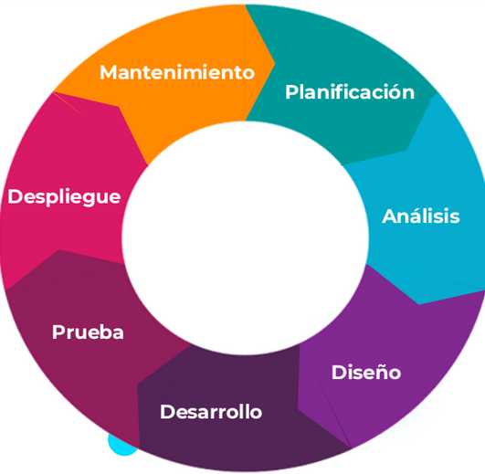

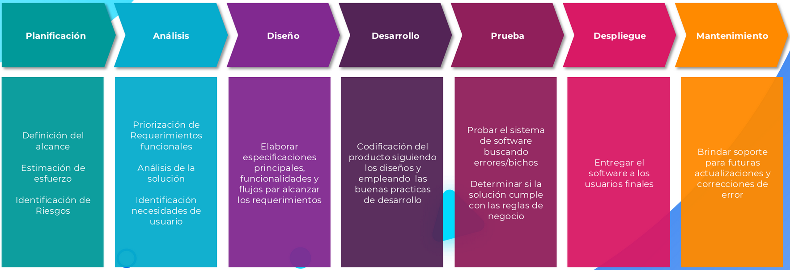

#### Modelos de desarrollo de software 

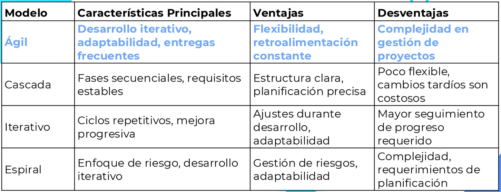

#### Metodologia Agil
Es un enfoque iterativo e incremental que se centra en la colaboracion continua entre equipos multidiciplinarios y clientes para entregar software funcional en ciclos cortos y regulares

    El Manifiesto Ágil, también conocido como el "Manifiesto por el Desarrollo Ágil de Software“. 
    Fue creado por un grupo de expertos en desarrollo de software en 2001 y ha sido
    ampliamente adoptado en la industria.

El Manifiesto Ágil consta de cuatro valores y doce principios que  enfatizan la colaboración, la adaptabilidad, la entrega temprana y la satisfacción del cliente.

Valores agiles
1. Individuos e interacciones sobre procesos y herramientas.
2. Software funcionando sobre documentación extensiva.
3. Colaboración con el cliente sobre negociación contractual.
4. Respuesta ante el cambio sobre seguir un plan.

Principios Agiles
1. Satisfacer al cliente a través de la entrega temprana y continua de software valioso.
2. Aceptar cambios en los requisitos, incluso en etapas tardías del desarrollo.
3. Entregar software funcional frecuentemente, con preferencia a intervalos cortos.
4. Colaboración constante entre los equipos de desarrollo y los interesados.
5. Construir proyectos en torno a individuos motivados y brindarles el entorno y el apoyo que necesitan.
6. La comunicación cara a cara es la forma más efectiva y eficiente de transmitir información dentro de un quipo.
7. El software funcionando es la medida principal de progreso.
8. Los procesos ágiles promueven el desarrollo sostenible. Los patrocinadores, desarrolladores y usuarios eben mantener un ritmo constante indefinidamente.
9. La atención continua a la excelencia técnica y al buen diseño mejora la agilidad.
10. La simplicidad, o el arte de maximizar la cantidad de trabajo no hecho, es esencial.
11. Los equipos autogestionados pueden tomar decisiones efectivas y rápidas.
12. En intervalos regulares, el equipo reflexiona sobre su eficacia y ajusta su comportamiento en  onsecuencia.

#### Marcosy enfoques de trabajo dentro de la metodologia Agil

Enfoque KANBAN 

Kanban es un enfoque de gestión visual que se utiliza para optimizar
el flujo de trabajo, aumentar la eficiencia y facilitar la colaboración en
equipos y proyectos.

El método Kanban se basa en principios y prácticas que ayudan a
mantener un flujo de trabajo constante y a mejorar continuamente el
proceso.

¿Como funciona Kanban?

1. Visualización en Tablero: Tareas como tarjetas avanzan por columnas que representan etapas del proceso,  eflejando estados de trabajo.
2. Límite de Trabajo: Kanban limita trabajo en progreso por etapa, evitando sobrecarga y manteniendo flujo  constante.
3. Gestión de Flujo: Las tarjetas avanzan entre columnas al progresar en el proceso, manteniendo  fluidez y previniendo cuellos de botella.
4. Asignación Dinámica: En vez de asignar tareas, los miembros del equipo las toman cuando pueden trabajar en ellas. optimiza la distribución del trabajo.
5. Mejora Continua: Los equipos son alentados a analizar el flujo de trabajo, identificar cuellos  de botella y áreas problemáticas, y tomar medidas para optimizar el proceso.
6. Retroalimentación: Es posible identificar patrones y tendencias, lo que facilita la toma de decisiones informadas y el aprendizaje constante.

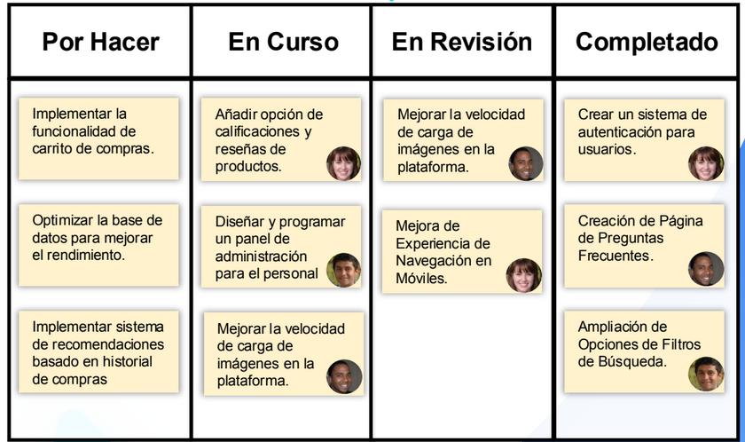

Ceremonias de equipo Kanban 

• Reunión de Planificación del Trabajo: Las tareas se añaden al tablero Kanban a medida que
surgen y se asignan según la capacidad del equipo. El trabajo se gestiona de manera continua,
centrándose en mantener un flujo constante.

• Reunión Diaria: Aunque no es obligatoria, algunos equipos en Kanban pueden optar por tener una
breve reunión diaria para sincronizar el trabajo. Los miembros del equipo comparten
actualizaciones rápidas sobre lo que están haciendo, los posibles bloqueos y cómo avanzarán.

• Reunión de Revisión del flujo de trabajo: El equipo se reúne periódicamente para analizar el flujo
de trabajo y discutir mejoras. Pueden identificar cuellos de botella, áreas de mejora y ajustar las
políticas del tablero Kanban.

• Reuniones no programadas: A medida que surgen necesidades, los equipos en Kanban pueden
realizar reuniones adicionales para resolver problemas específicos o abordar situaciones
inesperadas.

Enfoque SCRUM

El marco de trabajo Scrum es una metodología ágil ampliamente
utilizada para gestionar proyectos de desarrollo de software. Scrum se
basa en un enfoque iterativo e incremental que permite la entrega
continua de valor.

La colaboración, la adaptación constante y la entrega incremental de
valor son los pilares centrales de Scrum.

#### Roles y responsabilidades de un equipo segun scrum
**Equipo de Desarrollo**: Se compone de los miembros responsables de diseñar, codificar, probar y entregar los incrementos del producto.
**Scrum Master**: Desempeña el rol de facilitador y entrenador del equipo Scrum, trabajando en la eliminación de obstáculos y asegurando la implementación correcta de Scrum.
**Product Owner**: El "Product Owner" (o "Dueño del Producto" en su traducción al español) representa al cliente y gestiona el Product Backlog, definiendo las funcionalidades y prioridades del producto.

#### Los artefactos segun SCRUM
**Backlog del producto**: Es una lista priorizada de todas las funcionalidades y requisitos del producto. Es propiedad del “Product Owner” y se actualiza constantemente.
**Backlog del Sprint**: Es una lista de tareas seleccionadas del “Product Backlog” para el sprint actual. Es propiedad del equipo de desarrollo.
**Incremento**: Es el resultado del trabajo realizado en un sprint. Debe ser potencialmente entregable y agregar valor al producto.

#### Eventos o ceremonias en Scrum
“Daily Scrum” (Reunión diaria): Es una reunión breve y diaria en Scrum con el objetivo de que el equipo comparta actualizaciones y sincronice su trabajo.

Cada miembro responde a tres preguntas clave: **¿Qué hice ayer?**, **¿Qué haré hoy?** y
**¿Existen obstáculos en mi camino?.**

**Revision del sprint**:Al finalizar el sprint, ocurre la Revisión del Sprint. En esta ceremonia, el equipo presenta su trabajo al Product Owner, las partes con interés directo en el proyecto (stakeholders) y otras partes interesadas.

Se discute el progreso, se muestra un incremento funcional del producto y se obtiene feedback  alioso. Esta revisión guía el rumbo del producto y asegura su evolución según las expectativas.

**Retrospectiva del Sprint**: Después de la Revisión del Sprint, se realiza la Retrospectiva del print. En esta reunión, el equipo reflexiona sobre el sprint pasado, evaluando fortalezas y oportunidades de mejora.
Se definen acciones concretas para aplicar en el próximo sprint, fortaleciendo la mejora continua y la  efectividad del equipo.

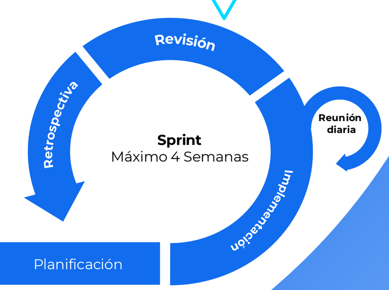

#### LeSS (Scrum a gran escala)
Es un marco de trabajo diseñado para expandir Scrum en organizaciones que cuentan con múltiples equipos de desarrollo colaborando en un mismo producto o proyecto.

LeSS se basa en los principios de Scrum pero promueve la simplicidad, la colaboración y la comunicación efectiva entre equipos para lograr una entrega de valor coherente y eficiente en proyectos de mayor envergadura.

¿Como funciona LeSS?
**Roles Simplificados**: LeSS mantiene los roles fundamentales de Scrum,
como el Scrum Master, el Product Owner y el Equipo de Desarrollo. Sin
embargo, se promueve una estructura organizativa más plana y menos
jerárquica.

**Backlog de producto Único**: En lugar de dividir el Product Backlog entre los
equipos, Less utiliza un único Backlog de producto compartido por todos los
equipos. Esto asegura una visión unificada de las prioridades y evita
duplicación de esfuerzos.

**Sprint y Sincronización**: Todos los equipos trabajan en el mismo sprint de
duración fija. Esto facilita la sincronización entre los equipos y permite
alinear las entregas y las retroalimentaciones.

**Reuniones de Coordinación**: LeSS introduce las "Reuniones de Coordinación", donde los Scrum Masters y algunos miembros del Equipo de Desarrollo de cada equipo se reúnen para abordar problemas de coordinación y compartir información relevante.

**Comunicación Abierta**: La comunicación entre equipos es fundamental en Less. Se fomenta la colaboración y la resolución de problemas entre equipos para mantener una visión coherente y evitar conflictos.

**Énfasis en la Simplificación**: LeSS aboga por simplificar el proceso y minimizar la burocracia. Se promueve la eliminación de prácticas y artefactos innecesarios para mantener la agilidad.

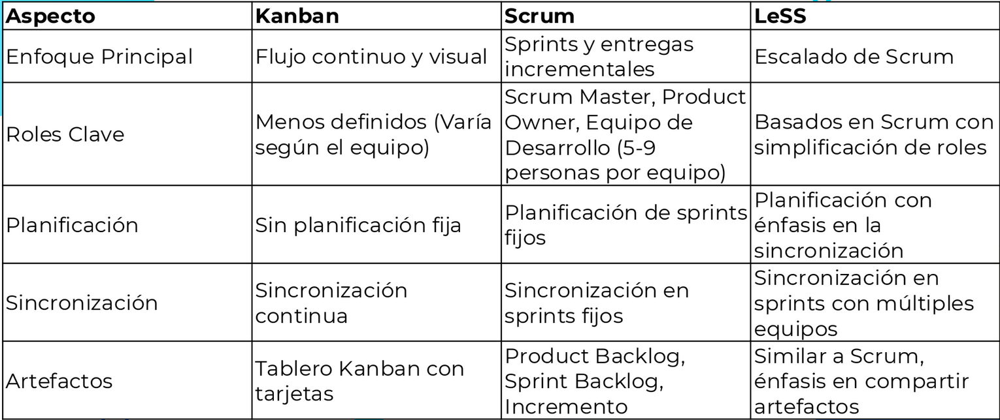

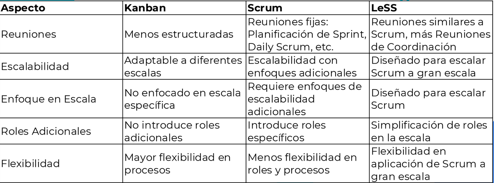

## Las 4P's en la planificacion de un Proyecto de Software 
Las 4 P's describen un conjunto de componentes criticos que desempeñan un papel fundamental en la planificacion de un proyecto de software: Personas, Producto, Proceso y Proyecto 

* Representan una simplificacion o desglose de las etapas clave dentro del ciclo de vida de desarrollo de software
* Cada una de las etapas de las 4'ps se correlaciona con actividades especificas en el proceso general de desarrollo de software 
  
 
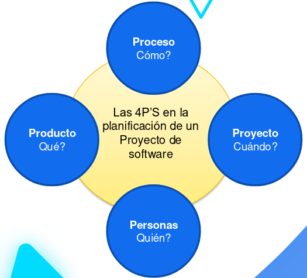

**Producto:**Hace referencia al producto que se desarrolla, lo que implica definir los requerimientos y las carcateristicas del software, como los objetivos claros en terminos de funcionalidad, rendimiento, seguridad y usabilidad
**Personas:**Personas involucradas en el proyecto, como al equipo de desarrollo, los stakeholders, usuarios finales y cualquier otro individuo que tenga un rol en prpyecto
**Proceso:**Eleccion de la metodologia de Desarrollo (como Scrum, Kanban, etc.)la planificacion de las iteraciones o fases, la asignacion de las tareas, la gestion de cambios y la garantia de calidad
**Proyecto:**Establecer un cronograma, definir objetivos. Asignar recursos y presupuestos, gestionar riesgos y comunicarse eficazmente con todas las partes interesadas

[las 4p's](https://www.geeksforgeeks.org/software-engineering/4-ps-in-software-project-planning/)

## Revision de la Gestion de configuracion de Software (SCM)
La Gestión de la Configuración del Software, conocida por su acrónimo en inglés “Software Configuration Management” (SCM), es esencial en el Ciclo de Vida del Desarrollo de Software (SDLC) para controlar elementos como el código y la documentación, lo que asegura un desarrollo ordenado y cambios efectivos.

El SCM se aplica en todas las etapas del SDLC para mantener versiones, rastrear cambios y gestionar configuraciones, lo que mejora la estabilidad y la mantenibilidad del software

Una plataforma de Gestión de la Configuración del Software es un conjunto de herramientas, procesos y recursos que permiten a los equipos de desarrollo de software gestionar y controlar de manera
efectiva los elementos que componen un proyecto de software 

Funcionalidades comunes de las plataformas SCM
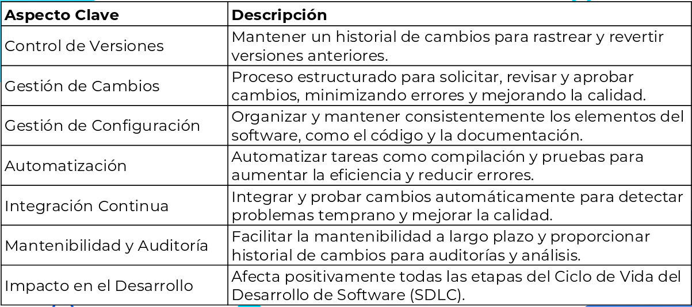

Ejemplo:
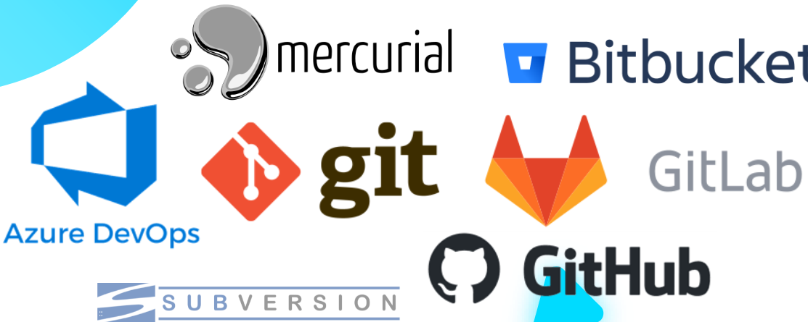

## Comandos de git 
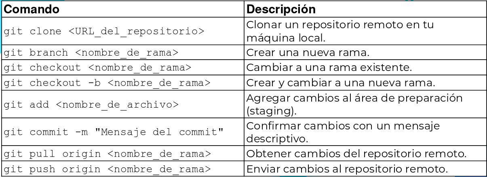

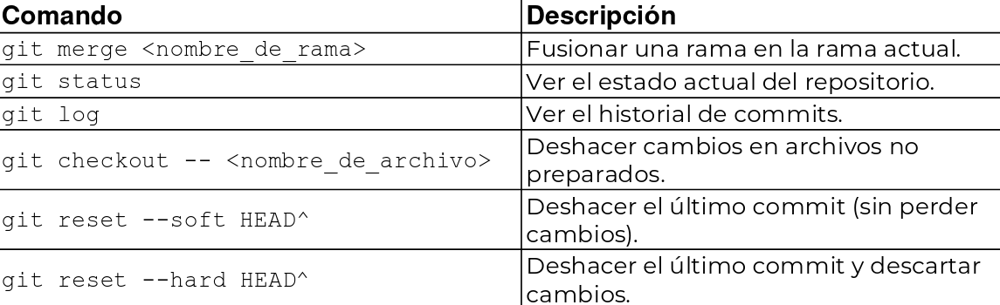