# Analisis de requermientos en el desarrollo de software 

## Ingenieria de requerimientos de Software
La ingeniería de requerimientos en el desarrollo de software se centra en identificar, documentar, analizar, validar, y gestionar los requisitos del sistema o software en desarrollo. Estos requisitos detallados definen qué debe lograr el software y cómo debe operar para satisfacer las necesidades de los usuarios y los objetivos del proyecto.

**Objetivos de la ingenieria de Requerimientos:**

* Satisfaccion de usuarios y objetivos de negocio
* Especificacion y base para el diseño
* Evitar malentendidos y fomentar la comunicacion efectiva
* Reduccion de riesgos y gestion de cambios

#### Tipos de requerimientos:
- **Requerimientos de Usuario**:Son las Necesidades, expectativas y funcionalidades específicas que los usuarios finales y las partes interesadas desean que el
software cumpla.
- **Requerimientos de Sistema**: Enfocados en la ooperacion tecnica del sistema, consideran su iteraccion, funcionamiento, rendimiento, seguridad y escalabilidad, esenciales para su efectividad y eficiencia. Describe como se traduciran los requerimientos en el diseño real del software. Esto implica la arquitectura, la estrcutura de datos, los componentes del sistema, las interacciones y otros detalles tecnicos 

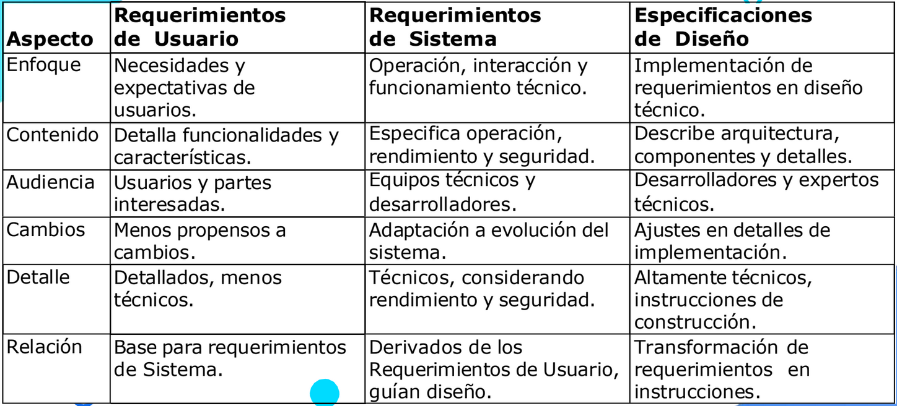

#### Tipos de requerimientos en el procesos de desarrollo de software
Los requerimientos funcionales y no-funcionales, junto con los requerimientos de
dominio, son tres tipos principales de requerimientos utilizados en el proceso de
desarrollo de software y en la ingeniería de sistemas en general

 Funcionales

Los requerimientos funcionales son vitales en el desarrollo de software, ya que
describen las acciones y capacidades específicas que un sistema o software debe
lograr.

Al detallar operaciones, tareas y comportamientos concretos, enriquecen la comprensión completa de las funcionalidades del sistema y proporcionan una guía clara para el diseño y desarrollo efectivo.

A través de esta categoría, se logra una especificación concisa de las capacidades que el software debe ofrecer, sentando las bases para un diseño y desarrollo exitosos.

Tipos de requerimientos funcionales:
* De Entrada: Estos requerimientos se centran en las entradas que el sistema debe
aceptar, como datos ingresados por el usuario u otras fuentes.
* De Proceso: Describen las operaciones internas y procesos que el sistema debe
llevar a cabo para procesar los datos y generar resultados.
* De Salida: Se refieren a las salidas o resultados que el sistema debe generar en
respuesta a las entradas y procesos realizados.
* De Interfaz de Usuario: Describen cómo los usuarios interactuarán con la interfaz
del software, incluyendo elementos de diseño y navegación.
* De Almacenamiento: Definen cómo el software debe gestionar y almacenar los
datos de manera segura y eficiente.
* De Comunicación: Se refieren a la forma en que el sistema debe comunicarse con
otros sistemas o componentes, ya sea interna o externamente.
* De Validación y Verificación: Establecen cómo el sistema debe validar y verificar la
exactitud y la integridad de los datos y las operaciones.
* De Flujo de Trabajo: Describen las secuencias de acciones que el sistema debe
seguir para completar ciertos procesos o tareas.
* De Seguridad: Definen cómo el sistema debe gestionar la seguridad de los datos y
las funciones, incluyendo autenticación y autorización.
* De Integración: Especifican cómo el software debe integrarse con otros sistemas o
servicios externos.

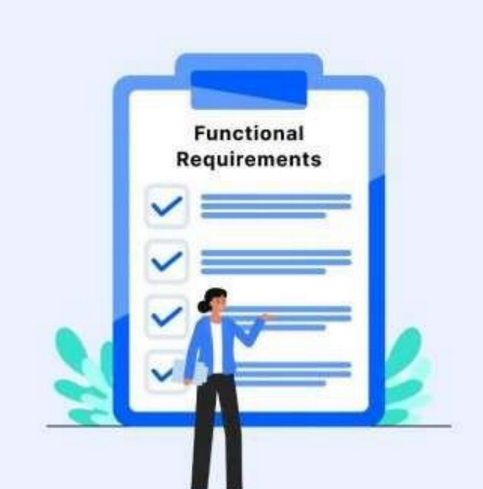

 NO Funcionales

Los requerimientos no funcionales son una categoría de requerimientos en el desarrollo
de software que se enfoca en atributos y características distintos de las funcionalidades específicas del sistema.

Definen cómo el software debe comportarse en términos de características más amplias y cómo debe satisfacer necesidades y expectativas más allá de las funcionalidades básicas.

Entre estos se encuentran el rendimiento, la seguridad, la usabilidad, la escalabilidad, la disponibilidad y la mantenibilidad, entre otros.

Tipos de requerimientos no funcionales:
* Rendimiento: Relacionado con la velocidad y eficiencia del sistema bajo
diferentes condiciones de uso y carga.
* Seguridad: Enfocado en la protección de datos y sistemas, previniendo
accesos no autorizados y manteniendo la confidencialidad e integridad.
* Usabilidad: Se refiere a la facilidad de uso y accesibilidad del sistema para
los usuarios, buscando una experiencia positiva y intuitiva.
* Escalabilidad: La capacidad del sistema para adaptarse y manejar
aumentos en la carga de trabajo y la demanda sin perder rendimiento.
* Disponibilidad: Define el tiempo durante el cual el sistema debe estar
disponible para los usuarios y la velocidad de recuperación tras fallos.
Mantenibilidad: Relacionado con la facilidad para realizar cambios,
actualizaciones y correcciones en el sistema a lo largo del tiempo.
* Compatibilidad: Asegura que el sistema funcione correctamente en
diferentes entornos, dispositivos y plataformas.
* Cumplimiento Legal y Normativo: Se refiere a la adhesión a regulaciones,
estándares de la industria y requisitos legales.
* Eficiencia de Recursos: Enfocado en el uso eficiente de recursos como CPU,
memoria y ancho de banda para optimizar el rendimiento y la sostenibilidad.

 De dominio

Se centran en aspectos específicos del entorno, la industria o el contexto en el que se desplegará el sistema.
Estos requerimientos se derivan de la comprensión profunda del dominio en el que operará el software y tienen como objetivo garantizar que el sistema sea adecuado y cumpla con las regulaciones, prácticas y necesidades únicas del entorno en cuestión.

Los requerimientos de dominio pueden incluir restricciones legales, consideraciones
de seguridad, características específicas de la industria y cualquier otro factor que sea
relevante para el contexto en el que se utilizará el software.

Tipos de requerimientos de dominio:
* Legales y Regulatorios: Involucran leyes y regulaciones que el software debe
cumplir en su dominio, como privacidad, seguridad de datos y estándares de la
industria.
* De Industria: Proceden de prácticas y estándares propios de la industria. Ejemplo:
en la medicina, pueden existir requisitos específicos para la gestión de registros
médicos electrónicos.
* De Seguridad: Enfocados en la seguridad del dominio, como protección de datos,
autenticación y prevención de intrusiones.
* Ambientales: Si el software se usará en entornos específicos, como manufactura o
gestión de recursos, pueden existir requerimientos ligados al entorno físico.
* Culturales y Lingüísticos: Para software en varias regiones o culturas, pueden
haber necesidades de localización, traducción y adaptación cultural.
* De Rendimiento: Algunos dominios requieren rendimiento específico, como
aplicaciones en tiempo real o alta disponibilidad.
* De Integración: Si el software se conecta con otros sistemas en el dominio, pueden
surgir requerimientos de integración específicos.
* De Usabilidad: Si el software se enfoca en un grupo demográfico, pueden surgir
necesidades específicas de usabilidad para ese grupo.
* De Adaptación: En entornos cambiantes, como la industria financiera, pueden
haber requerimientos para que el software se adapte a cambios regulatorios o de
mercado.

### **Ejemplos de requerimientos segun su tipo**
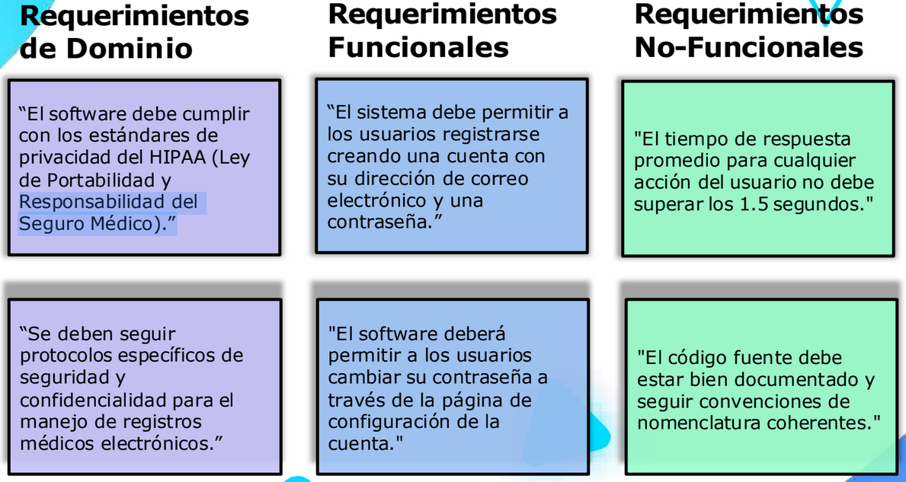

## Requerimintos de integracion 
**Dentro de los requerimientos no-funcionales, se incluyen los de integración de sistemas.**

Los requerimientos de integración se encargan de establecer objetivos y criterios generales para la integración. Para completar estos requerimientos, entran en juego las especificaciones técnicas de integración. Estas especificaciones ofrecen los
detalles necesarios para orientar la ejecución práctica del proceso.

El enfoque de las especificaciones de Integración se refiere a la colaboración
entre componentes, sistemas o aplicaciones para alcanzar metas compartidas en un proyecto.

**Al definir interfaces, protocolos y detalles técnicos, estas especificaciones facilitan una integración exitosa, asegurando una operación fluida y coordinada.**

Los Requisitos de Integración son esenciales para asegurar que los sistemas conectados
operen de manera coherente y cumplan con los objetivos del proyecto.

Estos requisitos permiten una interoperabilidad efectiva, garantizando el éxito en proyectos que requieren una colaboración armoniosa entre diversos elementos.

Beneficios de las especificacion de integracion: 
- Claridad y comprension comun
- Reduccion de malentendidos
- Roles y responsabilidades claros
- Fecilitacion de la colaboracion
- Referencia Documentada 
- Resolucion de desacuerdos
- Planificacion efectiva
- Eficiencia en las pruebas
- Minimizacion de riesgos

## Tecnicas basicas para la colaboracion entre sistemas y equipos 

Definicion de interfaces

La Definición de Interfaces es un proceso esencial que implica la creación de
puntos de interacción claros y específicos entre sistemas o componentes. Estas actúan como "contratos" que establecen reglas y pautas para la comunicación efectiva y la colaboración entre diferentes partes del software.

Al definir interfaces sólidas, se garantiza que los sistemas puedan interactuar de manera predecible y sin problemas. Esto reduce el riesgo de malentendidos y conflictos entre equipos de desarrollo, ya que todos los involucrados operan bajo las mismas directrices.

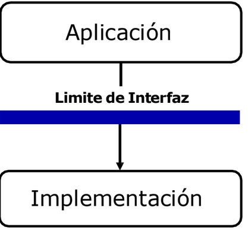

Separacion de depednencias 

Al aplicar esta estrategia, reduces las interdependencias entre los componentes, posibilitando el uso de implementaciones simuladas para aislar módulos del sistema. Esto permite un control más preciso, disminuye efectos secundarios y potencia la flexibilidad y el desarrollo en paralelo.

Los "Fakes", "Stubs" y "Mocks“ pueden ser utilizados en el desarrollo para simular interacciones con componentes reales y lograr un aislamiento efectivo entre ellos.

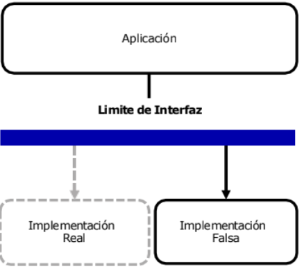

Fakes, Mocks y Stubs

**Fakes (Implementaciones Falsas):** Son versiones simplificadas de componentes
reales empleadas para aislar una unidad de código de sus dependencias reales. Pueden
incluir bases de datos en memoria, servicios simulados u implementaciones que imitan el comportamiento esencial de los componentes reales

**Mocks:** Son representaciones simuladas de componentes reales que se emplean para simular interacciones y comportamientos dinámicos. Los mocks se configuran para responder de manera específica a ciertas interacciones, lo que posibilita el
control y la evaluación de cómo responde la unidad bajo escenarios concretos.

**Stubs**: Son implementaciones estáticas de componentes o funciones utilizados para ofrecer respuestas predefinidas. A diferencia de los mocks, los stubs no simulan comportamientos dinámicos; en cambio, proporcionan respuestas estáticas a las llamadas de funciones o métodos.

## Analisis de requerimientos en el "SDLC"

* **Planificacion:** En esta etapa inicial, se identifican las necesidades y oportunidades para el
desarrollo del software. Se realiza un análisis preliminar de los requerimientos para determinar si el proyecto es factible y viable desde el punto de vista técnico, financiero y temporal.
* **Analisis:** se realiza un examen detallado de las necesidades y expectativas de los usuarios y las partes interesadas. Se recopilan, documentan y desglosan los requerimientos funcionales y no funcionales del sistema.
* **Diseño:** Una vez que los requerimientos están claros, se utiliza la información del análisis para diseñar la arquitectura general del sistema. Los requerimientos de diseño, como la estructura de los módulos y la interfaz de usuario, se basan en los requerimientos analizados.
* **Desarrollo/Implementacion:** Los equipos de desarrollo utilizan los requerimientos como base para codificar y construir el software. Los requerimientos funcionales guían la implementación de las funcionalidades y las
acciones específicas que el sistema debe realizar.
* **Prueba:** Se verifica que el software cumpla con los requerimientos establecidos. Se desarrollan casos de prueba basados en los requerimientos funcionales y no funcionales para asegurarse de que el sistema funcione correctamente.
* **Despliegue:** El software es entregado a los usuarios finales basándose en los requerimientos acordados. Los usuarios evalúan si el software satisface sus necesidades y si los requerimientos se han cumplido adecuadamente.
* **Mantenimiento:** A lo largo del ciclo de vida del software, los requerimientos pueden cambiar debido a actualizaciones, mejoras o cambios en las necesidades de los usuarios. La fase de mantenimiento utiliza el análisis de requerimientos para evaluar y realizar cambios en el software.

Cuando se tienen los requerimientos, estas se descomponen en tareas mas pequeñas y mas manejables, el camino es:

**Epicas (Epics) --> Caracateristicas (Features) --> Historias de usuario (User histories) --> Tareas (Task)**

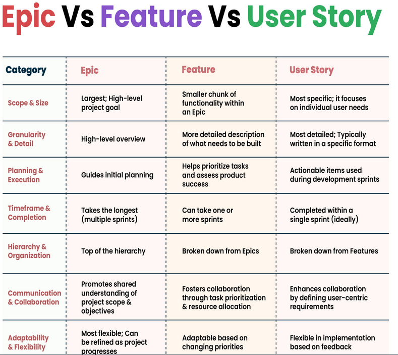

Epicas (Epics)

Son unidades de trabajo de alto nivel que representan funcionalidades o características amplias y significativas dentro de un proyecto.

Son objetivos o requisitos de gran alcance que generalmente no pueden implementarse en una única iteración o sprint. Las épicas ayudan a proporcionar una visión general y estratégica de lo que se planea lograr en el proyecto y luego se dividen en características
manejables.

Caracteristicas (Features) 

Es una funcionalidad específica y distintiva que un producto o
sistema ofrece para cumplir con las necesidades o requisitos del usuario.

Estas características son unidades de trabajo  más manejables y se implementan para agregar valor al producto final.

Cada característica es una parte funcional del software que se diseña, desarrolla, prueba y entrega de manera independiente, permitiendo a los usuarios realizar tareas específicas u objetivos.

Las características varían en tamaño y complejidad. Algunas son simples, otras más elaboradas, pero en general, todas
contribuyen al conjunto de funcionalidades que un producto ofrece a los usuarios.

Historias de usuario (UserHistories)

son breves descripciones de funcionalidades desde la
perspectiva del usuario final.

A diferencia de los "features", las historias de usuario se centran en las necesidades del usuario, expresando qué acciones busca realizar y por qué. Mientras tanto, los
“features” son las partes específicas del software diseñadas para satisfacer esas necesidades y cumplir los objetivos
planteados.

Las Historias de Usuario son descripciones claras y orientadas al usuario. En un formato simple y centrado en el usuario, explican quién es el usuario, qué acción desea
realizar y por qué.

Estas historias capturan de manera comprensible los requisitos y objetivos, estableciendo la base para la planificación,
diseño y desarrollo en el proceso ágil de software.

Tareas (task)

es una unidad más pequeña y específica de trabajo que forma parte de la implementación de una Historia de Usuario o
de una Característica.

Las tareas son pasos concretos que deben completarse para llevar a cabo la funcionalidad descrita en una historia de
usuario o característica.

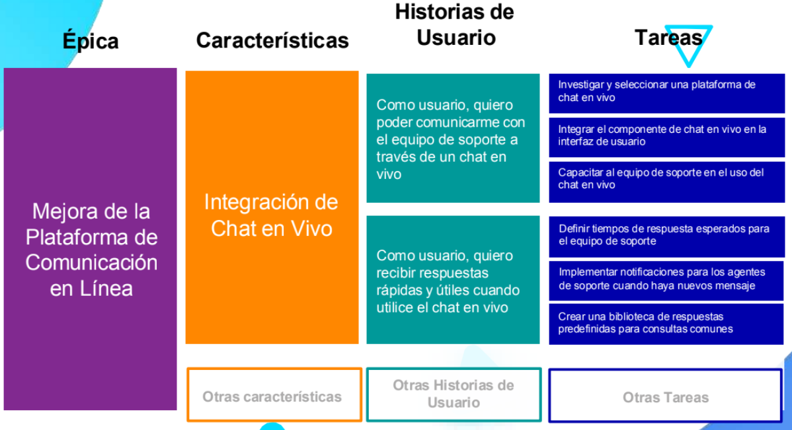

## Analisis de Casos de uso 
Los casos de uso en el análisis de requerimientos de software son una técnica utilizada para describir cómo interactúan los actores (usuarios o sistemas externos) con un sistema a través de escenarios específicos. Un caso de uso representa una interacción específica entre un actor y el sistema, y describe el flujo de eventos que ocurren cuando se realiza esa interacción.

Los casos de uso ayudan a capturar los requisitos funcionales del sistema desde la perspectiva del usuario y proporcionan una forma clara y comprensible de documentar los escenarios de uso.

En lugar de describir directamente los casos de uso, resulta más sencillo comenzar
describiendo escenarios. Un escenario es una secuencia de pasos que describe una
interacción entre un usuario y un sistema.
Por ejemplo, en el caso de una tienda en línea basada en la web, podríamos tener un
escenario llamado "Comprar un producto“:

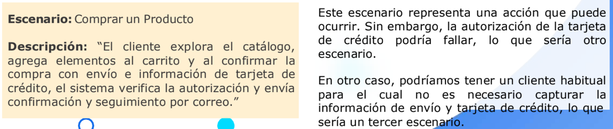 

Ejemplo de diagrama de casos de uso

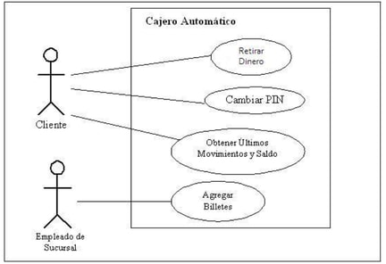

[Elementos del diagrama de casos de uso ](https://www.pmoinformatica.com/2021/02/elementos-diagrama-casos-de-uso.html)

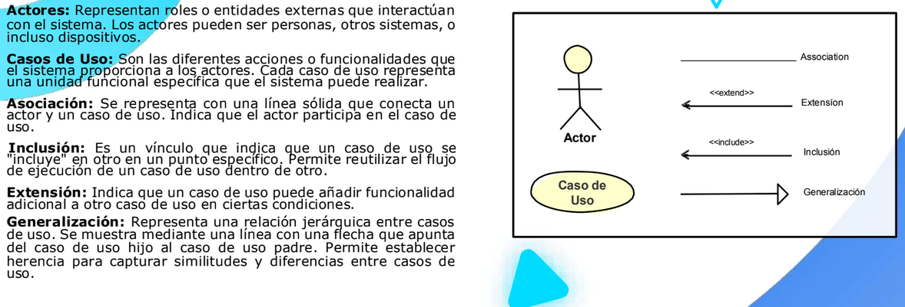

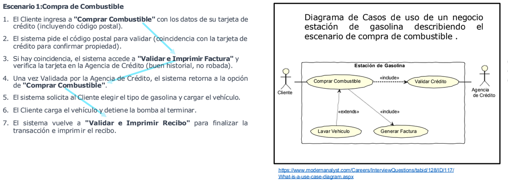
[Link](https://www.modernanalyst.com/Careers/InterviewQuestions/tabid/128/ID/117/What-is-a-use-case-diagram.aspx)

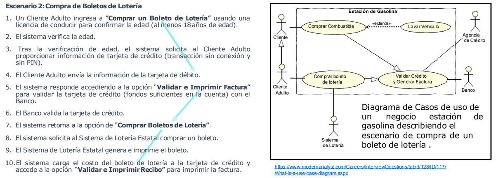
[Link](https://www.modernanalyst.com/Careers/InterviewQuestions/tabid/128/ID/117/What-is-a-use-case-diagram.aspx)

## Estimacion de requerimientos a Alto nivel

Las estimaciones de requerimientos a alto nivel brindan aproximaciones
iniciales de esfuerzo, tiempo y recursos para proyectos o fases. Se  realizan al comienzo de la planificación, cuando los detalles no están completamente definidos. Su propósito es lograr una comprensión panorámica del alcance y recursos necesarios.

Estimacion de requerimientos a alto nivel
Dentro del contexto ágil, las estimaciones a alto nivel se  iferencian de los enfoques en cascada al no buscar establecer un alcance rígido desde el principio. En su lugar, se alinean con la filosofía ágil, que enfatiza la flexibilidad, adaptación continua y colaboración como valores fundamentales.

Algunas ventajas de la estimaicon a alto nivel son:
- Vision Inicial y toma de decisiones Preliminares
- Flexibilidad y adaptabilidad
- Priorizacion y decisiones informadas

**Estimacion utilizando tamaños de camisetas**
Las estimaciones basadas en las categorías de "tallas de camisetas" (T-shirt sizes en inglés) son una técnica utilizada para valorar el esfuerzo, la complejidad y la magnitud relativa de tareas dentro de
proyectos de desarrollo.

En lugar de asignar valores numéricos específicos, como horas o días, se utilizan tamaños de camisetas (XS, S, M, L, XL, etc.) como representaciones de diferentes niveles de trabajo.

-XS (Extra Pequeño): Son elementos extremadamente pequeñas y sencillas que se pueden abordar con un esfuerzo mínimo.

-S (Pequeño): Elementos pequeñas y relativamente
sencillas que pueden completarse con poco esfuerzo.

-M (Mediano): Elementos de tamaño mediano que
requieren un esfuerzo moderado.

-L (Grande): Elementos más extensas y complejas que
involucran múltiples pasos o componentes. La
complejidad conlleva a un esfuerzo significativo para
su finalización.

-XL (Extra Grande): Elementos notoriamente grandes y
desafiantes que requieren un esfuerzo sustancial para
llegar a término.

-XXL (Doble Extra Grande): Reservado para elementos
excepcionalmente grandes o complejos que podrían
requerir una dedicación especial o un equipo
dedicado.

### Estimacion de Epicas a alto nivel
Esto permite comprender la amplitud y complejidad inherentes a estas unidades. Al asignar estimaciones a las épicas, se logra orientar su priorización considerando tanto el nivel de esfuerzo asociado como el valor que aportan al producto.

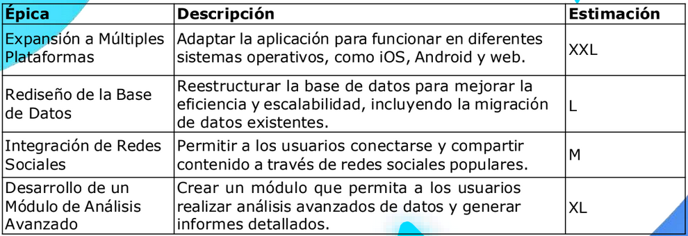

## Plan de accion (Roadmap)
Un “Roadmap”, también conocido como plan de acción, es una
representación visual y estratégica de la dirección en la que se planea llevar un producto en el transcurso del tiempo.

Funciona como una herramienta para comunicar la visión general, las
metas y las etapas clave de desarrollo en un formato fácilmente comprensible.

importancia en el desarrollo agil
- Comunicacion clara de la vision
- Planificacion Estrategica
- Flexibilidad y adaptabilidad
- Gestion de Expectativas
- Identificacion de Dependencias
- Alineacion con objetivos Estrategicos
- Priorizacion Informada

Ejemplo de Roadmap
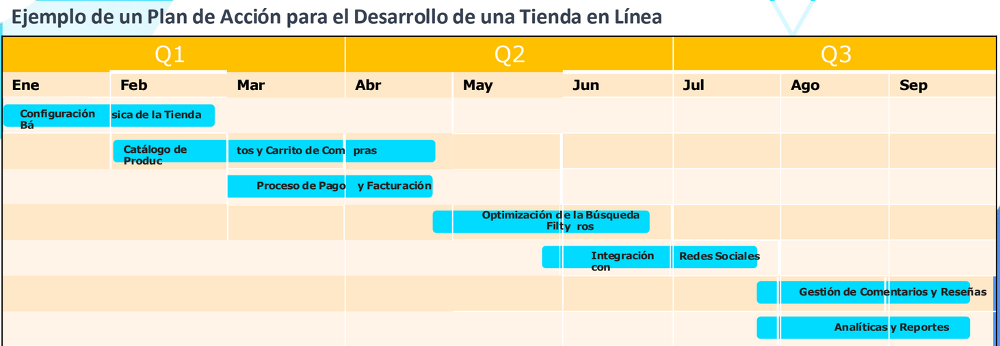

