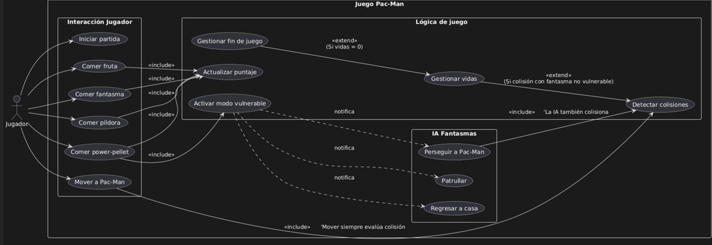

# Diagrama de casos de uso

# Crear los casos de uso de un juego básico de Pac-Man

En esta tarea, se te solicita crear una representación detallada de los Casos de Uso que definirán la funcionalidad y las interacciones clave en un juego de Pac-Man básico. El objetivo es diseñar una estructura clara y comprensible de cómo los actores interactúan con el juego, qué acciones pueden realizar y cómo se relacionan entre sí.

1. Actores y casos de uso principales: 
   - Actor: Jugador (único actor externo).   
   - Casos de uso que dispara:   
   - Iniciar partida   
   - Mover a Pac‑Man   
   - Comer: fruta / fantasma / píldora / power‑pellet   

2. Casos internos del sistema:   
    - Detectar colisiones   
    - Gestionar vidas   
    - Gestionar fin de juego   
	- Actualizar puntaje   
	- Activar modo vulnerable   
	- IA Fantasmas: Perseguir, Patrullar, Regresar a casa   

3. Relaciones «include» (obligatorias)   
	- Cualquier “Comer X”  →  Actualizar puntaje   
	- Comer power‑pellet  →  Activar modo vulnerable   
	- Mover a Pac‑Man  →  Detectar colisiones (se evalúa en cada movimiento)   
	- IA Fantasmas  →  Detectar colisiones (“La IA también colisiona”)   

4. Relaciones «extend» (condicionales)   
	- Gestionar vidas  ← Gestionar fin de juego   
	- Condición: si las vidas llegan a 0 se dispara el fin de juego.    
	- Detectar colisiones  ← Gestionar vidas   
	- Condición: si la colisión es con un fantasma NO vulnerable, se descuenta una vida.   

