# Procesamiento del Product Backlog (segun SCRUM)

## El backlog 
Es una lista dinámica y priorizada de elementos de trabajo pendientes que el equipo debe abordar como parte del proceso de desarrollo de un producto. Su función fundamental es simplificar la organización, priorización y gestión eficiente del trabajo, todo ello basado en el valor que cada tarea aporta al producto.

En el contexto de Scrum, se distinguen dos tipos principales de "backlog": el Backlog del Producto y el Backlog del Sprint.

En Scrum, el "backlog" es una lista estructurada y priorizada de PBIs (Product Backlog Items) o "Elementos del Backlog de Producto" en su versión en español.

Los PBIs a menudo representan las Historias de Usuario, pero también pueden representar características, funcionalidades, mejoras,correcciones de errores, investigaciones y otros elementos destinados a contribuir con el proceso de desarrollo del producto.

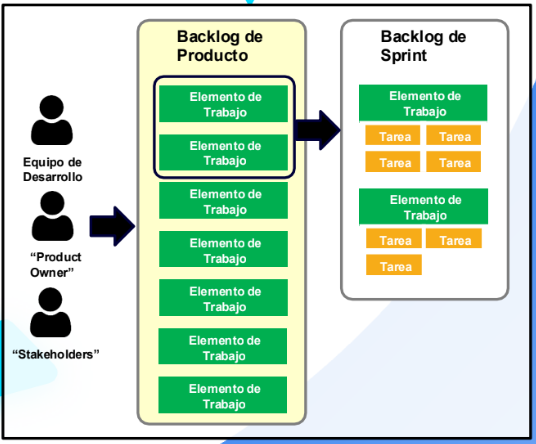

Es importante el equipo de desarrollo participe en creación y en la elaboración de los PBIs para aportar conocimientos y retroalimentación. No obstante, el "Product Owner“ es el principal responsable de definir y mantener los PBIs, asegurando su claridad y disponibilidad para ser abordados.
Además de esta función, el “Product Owner“ asigna una prioridad a cada PBI.

La priorización de los PBIs en el Backlog se realiza considerando su valor para el negocio, teniendo en cuenta a los “stakeholders” y usuarios del producto.

Durante la ceremonia de planificación del sprint, el equipo selecciona los PBIs que estima como alcanzables dentro del sprint y posteriormente los incorpora al Backlog de Sprint. Estos elementos son desglosados en
tareas específicas y detalladas para llevar a cabo su implementación.

### Tablero  del product backlog
El tablero Scrum  es util durante las reuniones diarias ("Daly Scrum") para identificar bloqueso y ajustar el plan segun sea necesario para alcanza los objetivos del sprint y ademas de fomentar la trasparencia y la colaboracion en el equipo

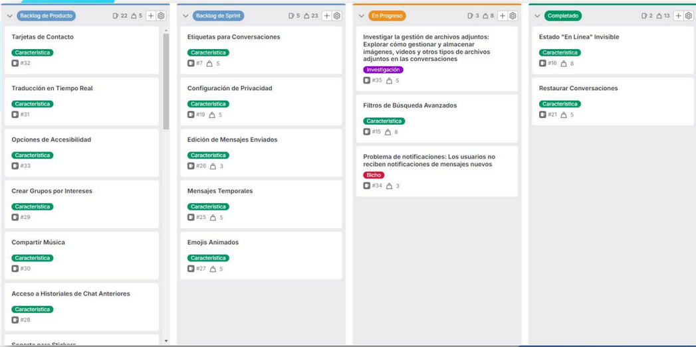

## El refinamiento del Backlog de Producto (DoR, INVEST, estimaciones)
Tambien conocido como "Product backlog Refinament (PBR)" o "Grooming del backlog", es una ceremonia que se realiza de forma regular a lo largo del ciclo de vida del proyecto, en el marco de la metodologia SCRUM

Esta actividad garantiza que los elementos de trabajo estén claros, priorizados y listos, lo que ahorra tiempo durante la planificación y facilita la ejecución efectiva del trabajo. Esto, a su vez, contribuye a la entrega de un producto de alta calidad que satisface las necesidades del negocio y de los stakeholders.

En las ceremonias de refinamientos, suelen participar:

* “Product Owner”: Dirige el proceso, selecciona y prioriza los PBIs, define criterios de aceptación y garantiza la alineación con las necesidades del negocio y “stakeholders”.
  
* Equipo de Desarrollo: Participa activamente con preguntas sobre los requisitos, aporta perspectiva técnica, estima el esfuerzo y divide los elementos si es necesario.
  
* “Scrum Master”: Facilita la sesión de refinamiento, asegura el cumplimiento de las mejores prácticas de Scrum y resuelve problemas u  obstáculos que puedan surgir durante el proceso.
  
* Otras partes interesadas: En ocasiones, miembros adicionales del equipo, representantes de usuarios, u otros especialistas pueden participar para brindar información o aclaraciones sobre los elementos.

### Estimacion de los elementos del proctut backlog 
Durante la estimación de los PBIs, se asignan valores que representan la complejidad y el esfuerzo requeridos para cada elemento del backlog de producto. Estos valores se expresan en escalas definidas por el equipo, como los puntos de historia, en lugar de medir el tiempo en horas o días. Esto permite una estimación relativa en lugar de una medida de tiempo precisa.

Un backlog bien refinado, con PBIs debidamente estimados, simplifica la planificación y ejecución del proyecto. Esto se logra al permitir que los
equipos tomen decisiones informadas sobre cómo abordar el trabajo en cada iteración (Sprint) en función de la complejidad y el esfuerzo relativos delos elementos.

La estimación de PBIs contribuye a mantener un enfoque constante en la entrega de valor al cliente. Al estimar de manera efectiva, el equipo puede priorizar y comprometerse con el trabajo de manera coherente, asegurando que las funcionalidades más valiosas se entreguen de manera regular al cliente.

#### Puntos de estimacion de historias de usuario

Los puntos de historia o “Story Points” en inglés, son una unidad de medida
empleada en el desarrollo de software ágil para estimar la complejidad y el
esfuerzo requeridos los elementos del backlog de producto.

Estas estimaciones se basan en comparaciones relativas y no en unidades de tiempo precisas, permitiendo a los equipos priorizar y planificar el trabajo de manera más efectiva.

Cada equipo puede definir su propia escala de puntos de historia, y a medida que avanza el proyecto, estos puntos ayudan a mejorar la predicción y la planificación.

La secuencia es una eleccion comun para la escala de puntos de hisotria, se usa la escala de fibonacci(0 1 1 3 3 5 8 13 21,etc)

Esto se usa en el scrum pocker, donde cada miembro del equipo dispone de un juego de cartas  enumeradas que siguen la secuencia de fibonacci

Pasos para llevar acabo el scrum poker:
1. Preparación: Preparación: Antes de comenzar, se distribuye a cada miembro del equipo un conjunto de cartas numeradas que siguen la secuencia de Fibonacci.
2. Selección del PBI: Se elige un PBI del Backlog de Producto para su estimación. Es fundamental que todos los miembros del equipo comprendan los detalles de la tarea antes de iniciar la estimación.
3. Estimación Privada: Una vez discutidos los detalles del PBI, cada miembro del equipo
selecciona una carta de estimación que refleja su percepción del esfuerzo necesario. Esto se hace de manera privada y simultánea para evitar influencias.
4. Revelación: Luego, todos los miembros del equipo revelan sus cartas de estimación al mismo tiempo. Si las estimaciones varían ampliamente, se inicia una discusión para comprender las razones detrás de las diferencias.
5. Consolidación: El equipo trabaja en conjunto para llegar a un consenso sobre la estimación final. Pueden discutir las razones detrás de las estimaciones individuales y
aclarar cualquier confusión.
6. Registro: La estimación final se documenta en el PBI para mantener un registro claro de la estimación asignada.
7. Repetición: Este proceso se repite para todas las tareas o historias de usuario que necesitan ser estimadas durante la planificación del sprint.

Antipatrones en la estimacion con puntos de historia
* Estimación en horas disfrazada: Esto contradice el propósito de los puntos de historia, que es estimar la complejidad relativa en lugar del tiempo real. Si se intenta forzar una conversión de puntos de historia a horas o días, se pierde la flexibilidad que ofrecen los puntos de historia.

* Estimaciones aisladas: Todos los miembros del equipo deben participar en la discusión y la estimación para aprovechar la sabiduría colectiva.

* Estimaciones individuales: Cuando los miembros del equipo hacen estimaciones individuales y luego se promedian, se pueden perder las discusiones y el consenso que son esenciales en la estimación. Esto puede llevar a estimaciones poco realistas.

* No considerar la incertidumbre: Puede llevar a compromisos poco realistas. Es importante reconocer y discutir la incertidumbre en torno a las tareas.

* No revisar las estimaciones pasadas: Las estimaciones anteriores y la velocidad del equipo pueden proporcionar valiosos puntos de referencia para futuras estimaciones.

* Ignorar el aprendizaje continuo: Las estimaciones deben ser una herramienta para refinar la planificación y la ejecución futura.

* Cambiar las estimaciones para ajustarse al calendario: Ajustar las estimaciones para que encajen en un calendario predeterminado puede llevar a la presión indebida sobre el equipo y la calidad del trabajo.

* Utilizar una escala inconsistente: No mantener una escala de puntos de historia consistente a lo largo del tiempo o entre equipos puede llevar a confusiones y
dificultades para comparar estimaciones.

## Definicion de listo (Definition of ready)
El concepto de "La Definición de Listo", más conocido como "Definition of Ready (DoR)"
en inglés, se utiliza durante la ceremonia de refinamiento del Backlog para establecer
criterios que deben cumplir los PBIs.

Esta definición garantiza que los elementos del backlog estén lo suficientemente
claros, detallados y preparados para ser abordados por el equipo de desarrollo durante la planificación del sprint, promoviendo así la transparencia y la eficiencia en el proceso de desarrollo de software en Scrum.

* Soncondiciones o estandares que se aplican a cada item del backlog antes de ser seleccionados para un Sprint
* Permite que cada equipo defina lo que significa "listo" de acuerdo con sus requerimientos unicos y objetivos especificos 

## Enfoque INVEST para el DoR
Es un acronimo usado en la etapa de refinamiento, normalmente utilizado como herramienta durante el proceso de la "Definicion de listo", para ayudar a establecer los criterios qie deben cumplir los PBIs

#### Principios de INVEST
- **I (Independent)** - Independiente: Un PBI debe ser lo más independiente posible de otros PBIs. Esto significa que debe poder ser desarrollado y entregado de forma aislada, sin depender en gran medida de otras funcionalidades.

- **N (Negotiable)**  - Negociable: Los detalles de un PBI deben ser negociables y flexibles. Los equipos deben poder discutir y ajustar los requisitos a medida que avanzan en el desarrollo, en lugar de estar totalmente prescritos desde el principio.

- **V (Valuable)** - Valioso: Un PBI debe aportar valor al usuario o al negocio. Debe tener un propósito claro y contribuir a los objetivos generales del proyecto.

- **E (Estimable)**- Estimable: Debe ser posible estimar el esfuerzo necesario para completar un PBI. Esto es importante para la planificación y programación
del trabajo.

- **S (Small)** - Pequeño: Los PBIs deben ser lo más pequeños y manejables posible. Esto facilita la planificación y la entrega continua de valor al dividir tareas complejas en partes más pequeñas y manejables.

- **T (Testable)**- Verificable: Debe ser posible definir criterios de aceptación claros para un PBI. Esto permite verificar si se ha cumplido con los requisitos y si la funcionalidad es correcta.

Ejemplo de INVEST  

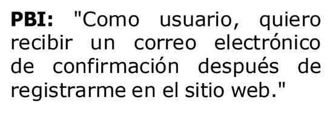

- I: Es independiente de otros PBIs. No requiere que se implementen otras características antes o después de su realización.

- N: Los detalles del formato y el contenido del correo electrónico pueden ser negociados entre el equipo de desarrollo y el “Product Owner” durante el refinamiento o la planificación.

- V: Proporcionar un correo electrónico de confirmación es valioso para el usuario, ya que les brinda la seguridad de que su registro se ha completado con éxito.

- E: El equipo de desarrollo puede estimar fácilmente el esfuerzo necesario para
implementar esta funcionalidad, ya que es un proceso común en el desarrollo web y se
entiende bien.

- S: Este PBI es lo suficientemente pequeño como para ser completado en un solo sprint, ya que se refiere a una tarea específica y limitada en alcance.

- T: Se pueden definir criterios de aceptación claros, como verificar que los usuarios reciban el correo de confirmación después del registro y que contenga la información correcta.

#### Caracteristicas esenciales de los BPI
1. **Descripción clara**: Cada PBI debe tener una descripción clara y concisa que evite
ambigüedades y garantice una comprensión clara antes del trabajo en el sprint.
Se recomienda iniciar la descripción con un verbo que indique la acción deseada,
por ejemplo, 'Como usuario, quiero...' o 'Para mejorar la eficiencia,
necesitamos...’.

2. **Criterios de aceptación definidos**: Cada PBI debe tener criterios que indiquen
cuándo se considerará que el elemento está completo y cumple con los requisitos.
Estos criterios sirven como una referencia precisa para evaluar el trabajo a ser
realizado durante el sprint, asegurando que se alcancen los resultados esperados
de manera coherente y consistente.

3. **Estimación de esfuerzo**: Cada PBI debe contar con una estimación del esfuerzo
necesario para su finalización. Esta estimación es usada para planificar y distribuir
eficazmente el trabajo durante el sprint, asegurando que se completen las tareas
sin esfuerzos excesivos por parte del equipo.

4. **Documentación relevante**: Cada PBI debe contar con cualquier documentación
o información adicional necesaria para comprender y desarrollar el elemento de
manera efectiva.

5. **Prioridad asignada**: Debe haber una prioridad inicial para el elemento en relación
con otros elementos del backlog, aunque esta prioridad puede ajustarse durante
la reunión de refinamiento.

### Ejemplo de un PBI refinado y listo

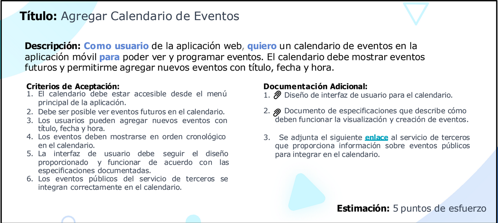

Recomendaciones para el proceso de refinamiento del backlog

* **Reuniones regulares de refinamiento**: Util para mantener un backlog actualizado y facilitar la seleccion de elementos para el proximo sprint. Asegurando que el equipo tenga una vision clara de los elementos del backlog mas maduros y  listos para ser abordados
* **Colaboracion y debate**: Aqui se aclaran dudas, compartir conocimientos y alinear a todos en el equipo con los objetivos

Anti-Patrones en el refinamiento del backlog

- Refinamiento insuficiente
- Falta de priorizacion
- PBIs demasiado grandes 
- Cambios constantes
- Falta de criterios de aceptacion
- Refinamiento monotono: pasar demasiado tiempo refinando un elemento de backlog sin avanzar en otros puede ser ineficiente y retrasar el proximo sprint
- Resistencia al cambio:resistirse a aceptar cambios en los elementos del backlg por parte del equipo de desarrollo o el "Product Owner"
- EXCESO DE DETALLE: incluir demasiados detalles en lso elementos del backlos
- falta de COMUNICACION

## Planificacion del Sprint (SMART, DoD)
La planificación del sprint en Scrum marca el inicio de un sprint durante el cual se llevará a cabo el trabajo previamente priorizado y refinado. Su objetivo principal es establecer qué entregables se abordarán durante el sprint y cómo se llevará a cabo ese trabajo de manera efectiva.

Ceremonias SCRUM
La ceremonia de planificación es una reunión altamente colaborativa que reúne a todo el equipo Scrum, incluyendo al **“Product Owner”**, el **“Scrum Master”** y el **equipo de desarrollo***. Durante esta sesión, se trabaja en conjunto para definir con claridad el
objetivo del sprint y cómo se llevará a cabo el trabajo para alcanzarlo.

## SMART para la planificacion del sprint
SMART (que puede traducirse como "Inteligente" en español) es una técnica
utilizada para establecer objetivos claros y bien definidos en la gestión de proyectos y la toma de decisiones en general.

Este enfoque se implementa típicamente durante la planificación del sprint en el
contexto de Scrum, cuando se requiere definir los objetivos y compromisos específicos para el sprint en curso.

#### Principios de SMART
- **S (Specific)** - Específico: Los objetivos deben ser claros y específicos en su descripción. Deben responder a preguntas como "¿Qué?", "¿Por qué?", "¿Quién?", "¿Dónde?" y "¿Cuándo?" para que todos comprendan exactamente lo que se quiere lograr.

- **M (Measurable)** - Medible: Los objetivos deben ser cuantificables y medibles en términos de progreso y éxito. Deben incluir criterios concretos que permitan evaluar si se ha alcanzado o no el objetivo. Esto implica establecer indicadores o métricas que se puedan seguir y medir.

- **A (Achievable)** - Alcanzable: Los objetivos deben ser realistas y alcanzables con los recursos y el tiempo disponibles. Deben estar dentro de las posibilidades y capacidades de las personas o equipos responsables de lograrlos.

- **R (Relevant)** - Relevante : Los objetivos deben estar alineados con los objetivos más amplios del proyecto. Deben tener un propósito y contribuir al logro de metas mayores.

- **T (Time-Boxed)** – Limitado en el Tiempo: Los objetivos deben tener un limite de tiempo definido o una fecha límite para su cumplimiento. Esto establece un plazo para el logro del objetivo.

### Ejemplode aplicacion de los principios de SMART
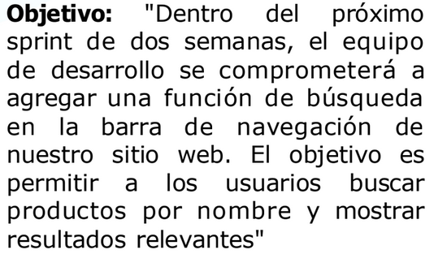

 - S: El objetivo se centra en agregar una función de búsqueda en la barra de navegación para buscar productos por nombre.

- M: Medir el éxito implica verificar que la función de búsqueda esté implementada y que los usuarios puedan buscar productos por nombre y obtener resultados relevantes al final del sprint.

- A: Este objetivo es alcanzable dentro del período de dos semanas y con los recursos
disponibles, ya que se refiere a una funcionalidad específica.

- R: La adición de una función de búsqueda es relevante para mejorar la experiencia
de usuario y facilitar la búsqueda de productos en el sitio web.

- T: Este objetivo tiene un marco de tiempo definido, que es el próximo sprint de dos
semanas.

## Definicion de completado (Definition of done DoD)
El concepto de "La Definición de Completado", más conocido como "Definition of Done (DoD)"en inglés, es un conjunto de criterios y condiciones que se deben cumplir para que un
elemento de trabajo se considere completamente finalizado y listo para su entrega al usuario final.

La “Definición de Completado” puede variar entre equipos, ya que se adapta a las
necesidades específicas y los estándares de calidad de cada proyecto. Este estándar de
finalización garantiza que el trabajo realizado cumpla con los requisitos y la calidad
esperados.

Ejemplo 
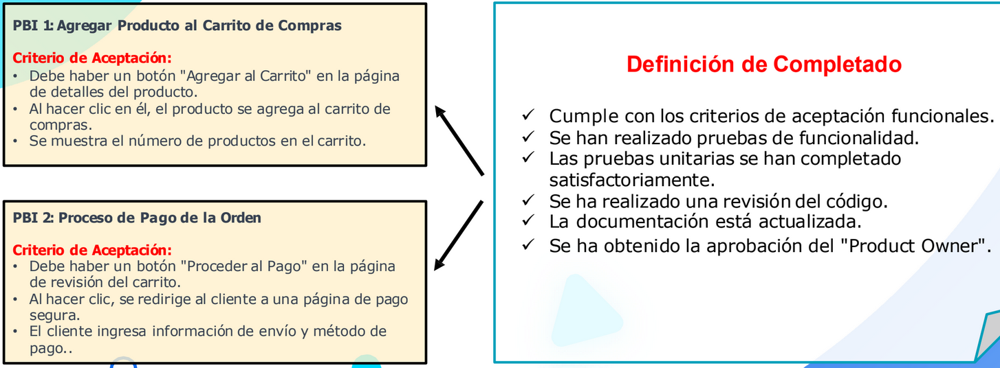

<sumary>Recomendaciones para el proceso de planificacion del sprint

- Reuniones regulares de refinamiento
- Colaboracion y debate
- 

<sumary>Anti-Patrones

- Planificacion del sprint insuficiente
- Sobrecarga de tareas
- Cambios frecuentes en el sprint: Introducir cambios significactivos en el sprint una vez ha comenzado puede desestabilizar el equipo y afectar negativamente la entrega planificada
- Fala de priorizacion de los elementos del backlog
- Ausencia de "DEfinition of done DoD": No establecer criterios claros de finalizacion para las historias de usuario o tareas puede llevar a malentendidos sobre que se considera "Completado"
- Desenfoque en los objetivos del sprint: Perder de vista los objetivos del sprint y centrarse demasiado en tareas tecnicas o en la resolucion de problemas puede llevar a una falta de alineacion con las metas del sprint
- Ignorar retroalimentacion del equipo
- Compromisos externos irrealistas:hacer compromisos externos basados en una planificacion de sprint poco realista puede generar estres en el equipo
- Falta de flexibilidad: No ser los sufiientemente flexible para adaptarse a cambios inesperados durante el sprint puede llevar a una planificacion rigida y poco efectiva

## Seguimiento del progreso de trabajo

El "burn donw" y "burn up"
El "Burn Down" y el "Burn Up" son herramientas visuales usadas en la gestión ágil de proyectos, diseñadas para supervisar el progreso del trabajo en distintas etapas del proceso.

Estas gráficas se emplean de manera habitual durante el sprint, manteniéndose actualizadas de forma constante para seguir de cerca el avance diario del equipo de trabajo.

Además, en la reunión de revisión del sprint, se aprovechan estos gráficos para comunicar a las partes interesadas el progreso real del trabajo, lo que facilita la evaluación de si se lograron los objetivos previamente establecidos y si se cumplió con el alcance planificado.

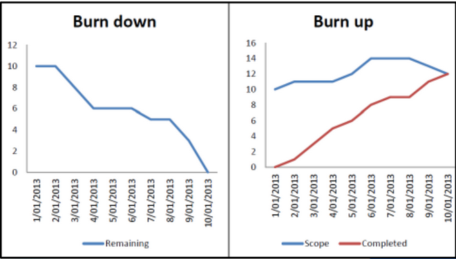

Burn Down

El "Burn Down" (conocido en español como "Gráfico de Reducción") es una herramienta
que visualiza la evolución de la cantidad de trabajo pendiente durante el transcurso de
un sprint.

En este gráfico, el eje vertical representa la completar, generalmente medido
cantidad de trabajo que aún queda por en unidades como puntos de historia. En
contraste, el eje horizontal muestra el progreso a lo largo del tiempo, dividido en
intervalos que pueden ser días, semanas o sprints.

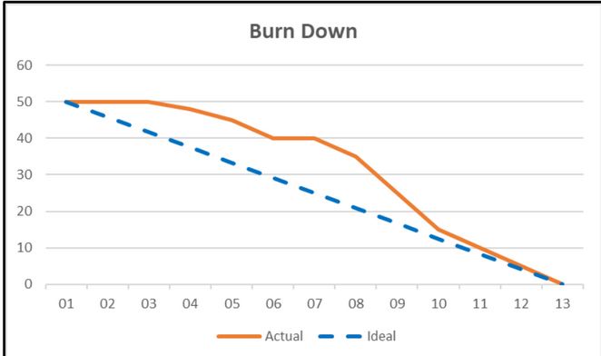

Algunos tipos de burn down

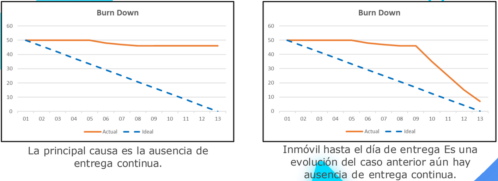

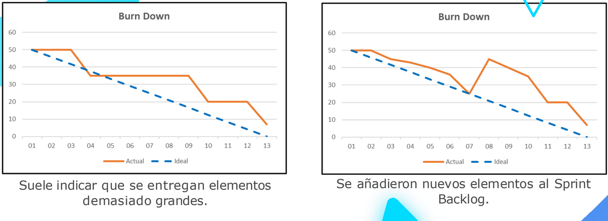

Burn Up

El "Burn Up" (conocido como "Gráfico de Aumento") es una herramienta que se
enfoca en el aumento del trabajo completado.

En este gráfico, El eje vertical representa la cantidad total de trabajo o alcance,
generalmente en unidades como puntos de historia, historias de usuario o características.
En cambio, el eje horizontal representa el tiempo, dividido en intervalos, como días,
semanas o sprints.

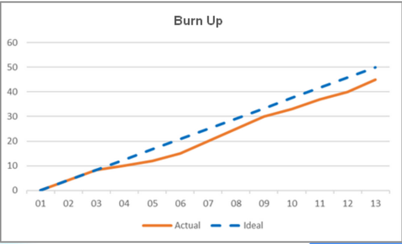

Algunos tipos de burn up

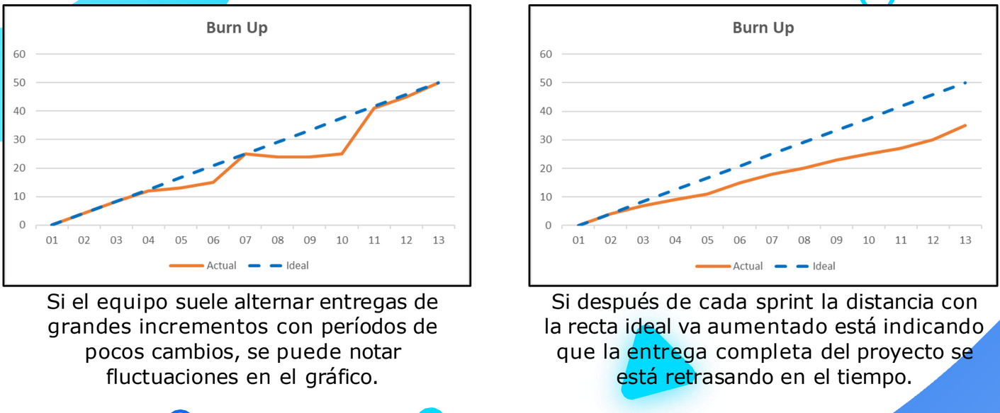

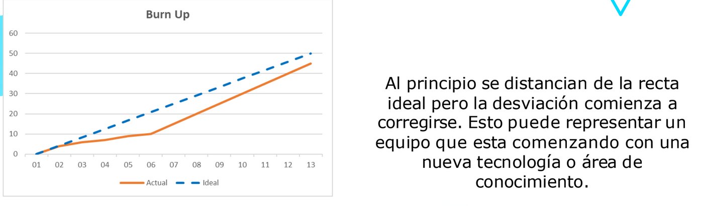

