# CM Avanzado y buenas practicas de codificacion 

# Almacenamiento de datos de GIt 
Git almacena sus datos como una serie de copias instantáneas de los archivos completos, tal y como se encuentran en ese momento.

Para optimizar la eficiencia, cuando los archivos no han experimentado modificaciones, Git no almacena nuevamente el archivo en sí, sino que conserva un enlace al archivo anterior idéntico que ya tiene almacenado.

Almacenamiento de datos a travez del tiempo
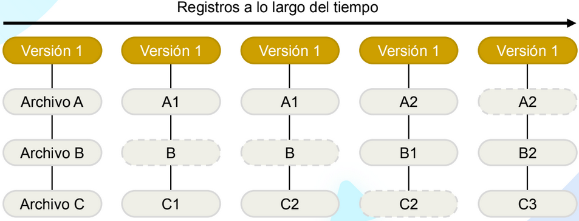

### Los estados principales de git 
- **Directorio de trabajo (Working Directory)**: En este estado, los archivos se encuentran en el sistema de archivos local. Los archivos en el directorio de trabajo son editados y modificados por el usuario de manera activa.

- **Área de preparación (Staging Area o Index)**: Los archivos en el área de preparación representan los cambios que se incluirán en el próximo “commit” o confirmación, pero aún no se han confirmado de manera permanente.

- **Repositorio (Repository)**: En este  estado, los archivos se encuentran en su estado final en Git. Los archivos en el repositorio están confirmados y versionados. Para
llevar los archivos desde el área de preparación al repositorio, el usuario debe usar el comando `git commit`.

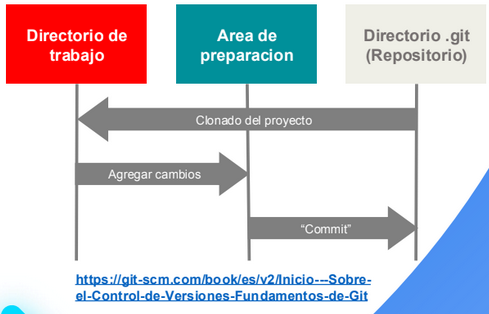

### Objetos GIT
- Blob (Blobs): Representa el contenido de un archivo. Cada versión de un archivo se almacena como un objeto blob. Los blobs contienen datos binarioso de texto sin formato.

- Árbol (Trees): Representa un directorio en Git. Contiene una lista de punteros a
objetos blobs y árboles, así como metadatos como nombres de archivos y permisos.

- Commit (Commits): Representa un punto en la historia de un proyecto. Contiene información sobre el autor, un mensaje del “commit” y un puntero al árbol que representa el estado del proyecto en ese momento.

- Etiqueta (Tags): Representa una referencia a un punto específico en la historia de Git, como un lanzamiento importante.

- Referencias (Refs): Git utiliza referencias para rastrear las ramas, etiquetas y el “HEAD” actual. Las referencias son punteros a objetos de confirmación o árboles.
    - Las ramas son simplemente referencias que apuntan a un objeto de confirmación específico.
    - Las etiquetas también son referencias que apuntan a objetos de confirmación específicos, generalmente utilizados para marcar versiones importantes.

- HEAD: HEAD es una referencia especial que indica la rama o confirmación actual en la que estás trabajando. HEAD es lo que te permite cambiar entre ramas y confirmaciones.

## Que son las ramas en git
Una "rama" (también conocida como "branch" en inglés) es una línea de
desarrollo independiente y aislada que se deriva de una rama principal o de otra
rama existente. Esencialmente, es una referencia dinámica que apunta a uno de los "commits" en la línea de tiempo del proyecto.

La rama principal, a menudo denominada "main" o "master“, es predeterminada en el repositorio y se crea automáticamente cuando se realiza el primer "commit" de cambios en un proyecto.

#### Buenas practicas para la ramificacion en proyectos de sotware 
- Utilizar nombres descriptivos para las ramas
- Mantener la rama principal limpia
- Crear una rama por tarea o funcion 
- Fusiionar con regularidad: Integrar los cambios de la rama principal en las ramas de desarrollo con regularidad 
- Eliminar ramas absoletas
- Comunicar cambios importantes

#### Convenciones de nombres en las ramas 
Las convenciones de nombramiento de ramas son directrices o reglas que definen cómo deben
nombrarse las ramas en un sistema de control de versiones como Git.

Estas convenciones ayudan a mantener un código organizado y estructurado, facilitan la
identificación del propósito de cada rama y promueven la colaboración dentro de los equipos de desarrollo

* Es importantes establecer y documentar convenciones de nombramiento, estas pueden variar de un equipo u organizacion a otra

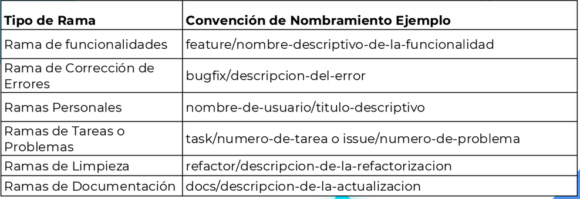

## Estrategias de ramificacion
Las estrategias de ramificación se enfocan en la gestión y organización de diversas líneas de desarrollo dentro de un repositorio Git.

Las ramas son una característica esencial en Git, ya que posibilitan el trabajo independiente en diferentes aspectos de un proyecto sin influir en la rama principal ni en otras ramas.

* La seleccion de una estrategia, define las pautas y recomendaciones sobre cuando y como crear diversas ramas en un repositorio
* Hay varias estrategias, pero depende las particularidades del proyecto y del quipo de desarrollo

Que resuelve la eleccion de una estrategia de ramificacion ?
* DEsarrollo concurrente: permite a multiples desarrolladores trabajar simultaneamente en diversos aspectos de un proyecto sin interfesirse entre si
* Mantenimiento de versiones estables: Asegura la existencia constante de una version confiable, estable y lista para su entrega
* Desarrollo de funcionalidades y correccion de errores: Facilita la  tarea de trabajar en nuevas funcionalidades y resolver problemas sin afectar la rama mas estable
* Gestion de versiones
* Control de calidad
* Experimentacion y pruebas

# GitFlow
Se basa en la idea de utilizar distintas ramas para administrar diversos aspectos del proyecto, como funcionalidades, corrección de errores, versiones, entre otros.

Ventajas y desventajas

**Ventajas de GitFlow**
- Estrcutura y organizacion
- Separacion de funciones
- Versiones y lanzamientos controlados 
- Soporte para correcciones rapidas

**Desventajas de GitFlow**
- Complejidad:para proyectos pequeños o  equipos con un enfoque agil, este se puede percibir complejo y sobrecargado de procesos
- Difucultad para mantener la rama principal estable: En proyectos donde se realizan cambios frecuentes en la rama principal, puede ser dificil mantenerla siempre estable, lo que podria aumentar la probabilidad de conflictos y problemas en produccion
- Mayor cantidad de Ramas
- Mas pasos para las entregas

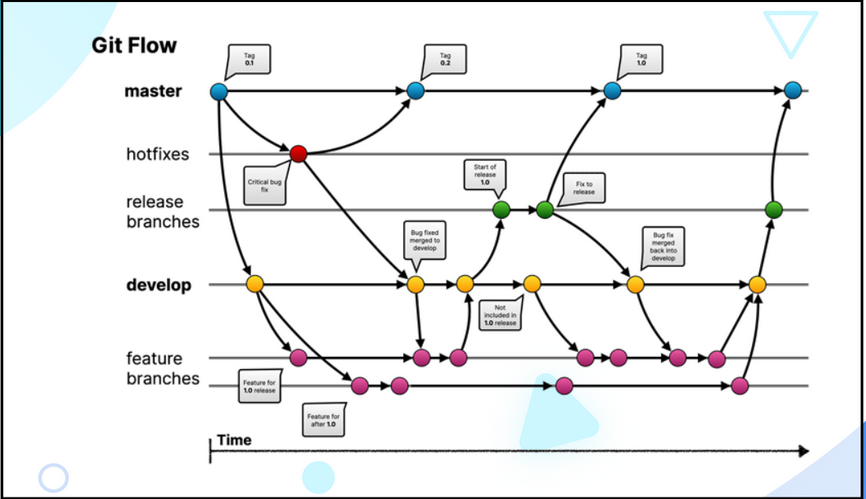

# GitHub Flow
Es una alternativa más simplificada a GitFlow, especialmente adecuada para equipos más pequeños, ya que no requiere gestionar múltiples versiones simultáneamente.

En Gitflow, no se utilizan ramas de entrega o “reléase”. En cambio, todas las funcionalidades, cambios y correcciones de errores se desarrollan en una única rama, que
posteriormente se elimina.

Ventajas y desventajas

**Ventajas  de Github Flow**
- Simplicidad
- Rapida entrega de funcionalidad
- Mayor enfoque en colaboracion: Al centrarce en una sola rama principal, github flow promueve una mayor colaboracion entre los miembros del equipo, ya que todos trabajan en la misma linea de desarrollo y se anima a fusionar cambios con frecuencia
- Adaptable; mas adaptable a proyectos agiles o equipos que necesitan cambios rapidos y frecuentes en su codigo

**Ventajas  de Github Flow**
-  No es adecuado para todos los casos: GitHub Flow es un enfoque de desarrollo ágil y continuo. Puede ser inadecuado para proyectos más grandes y complejos que requieren una planificación y una gestión de proyectos más rigurosas.
-  Requiere una disciplina estricta:Para que GitHub Flow funcione correctamente, los equipos deben seguir disciplinadamente las mejores prácticas, como la revisión de código, las pruebas exhaustivas y la documentación adecuada. Si los equipos no son
rigurosos, pueden surgir problemas de calidad y consistencia.
- Posibles conflictos: Cuando varios miembros del equipo trabajan en las mismas partes del código al mismo tiempo, pueden producirse conflictos al fusionar las solicitudes de extracción. Estos conflictos pueden ser difíciles de resolver y pueden requerir una
comunicación y colaboración efectiva para solucionarlos.
- No incluye una fase de planificación formal: GitHub Flow no incluye una fase de planificación formal, lo que puede hacer que sea difícil para algunos equipos coordinar y priorizar tareas a largo plazo.

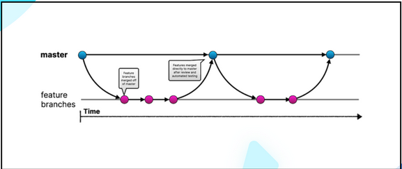

# GitLab Flow
Al igual que GitHub Flow, GitLab Flow representa una alternativa simplificada
a GitFlow al adoptar el enfoque de desarrollo basado en “features”.

Mientras que GitHub Flow se enfoca en la entrega continua y la colaboración
abierta mediante ramas de características temporales, GitLab Flow se diferencia al ofrecer una estructura más detallada que se apoya en múltiples entornos de entrega y
permite la existencia de ramas de características a largo plazo.

Gitñab flow divide el proceso de desarrollo en etapas definidas,como “desarrollo", “pre-
producción" y “producción". Cada etapa tiene su propio entorno yproceso de revisión.

GitLab Flow se enfoca en una gestión más detallada de las entregas en diferentes etapas y entornos, lo que puede ser útil en proyectos con requisitos de despliegue más
complejos

Ventajas y desventajas

**Ventajas  de GitLab Flow**
- Sencillez
- Entrega continua
- Control de versiones efectivo
- Enfoque en entornos: gitlab flow enfatiza la importancia de tener diferentes entornos para pruebas y entregas, lo que puede mejorar la calidad y la confiabilidad del software
- Fexibilidad en las ramas de caracteristicas: A diferencia de algunos otros flujos de trabajo, permite mantener ramas de funcionalidad drante mas tiempo si es necesario, lo que puede ser beneficioso para proyectos con mas funcionalidades complejas o que requieren una planificacion mas a largo pplazo

**Desentajas  de GitLab Flow**
- Simplicidad excesiva:Para proyectos muy grandes o complejos, GitLab Flow puede percibirse muy simple y carecer de estructura para un manejo más detallado de las ramas y los flujos de trabajo.
- No se adapta a todos los proyectos:No es adecuado para todos los tipos de proyectos. En particular, proyectos altamente regulados o con flujos de trabajo complejos pueden requerir un enfoque más avanzado.
- Necesidad de Disciplina del Equipo: Aunque GitLab Flow es sencillo, todavía requiere una disciplina sólida del equipo en términos de realizar pruebas adecuadas, mantener entornos separados y seguir las mejores prácticas de control de versiones.
- Posible Fragmentación del Código: Si las ramas de funcionalidades se mantienen durante mucho tiempo sin una fusión frecuente en la rama principal, puede haber fragmentación en el código y problemas de integración más adelante.

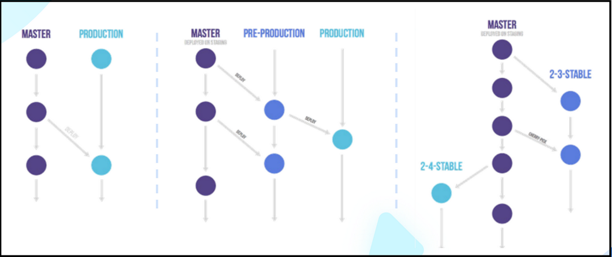

# Trunk-based Develoment
Se enfoca en mantener una única rama principal de desarrollo, generalmente denominada "trunk" o "main", como el punto central y estable del código fuente.

A diferencia de otros enfoques que involucran múltiples ramas de desarrollo, como GitFlow, GitHub Flow o GitLab Flow, que pueden añadir complejidad adicional, el
Trunk-Based Development simplifica el proceso de desarrollo y fomenta entregas continuas

- No se utilizan ramas de larga duración y no se les da mantenimiento. Por ejemplo, si se
detecta un error en una rama de entrega, se corrige en el tronco principal y luego se crea una nueva rama de entrega, sin necesidad de mantener la rama anterior.

- Se promueve hacer "commit" de manera regular, con el objetivo de reducir la distancia
entre los desarrolladores al iniciar la codificación de nuevas funcionalidades. Esto
fomenta una mayor colaboración y fluidez en el proceso de desarrollo.

- Cada "commit" incluye código funcional, lo que significa que se cumple con la definición de hecho (definition of done), se han creado las pruebas necesarias y se han tomado todas las medidas requeridas para garantizar que el código no introduzca errores
  
-El equipo debe demostrar un alto nivel de madurez y responsabilidad alentregar código. El estado del "trunk" debe mantenerse constantemente estable y en óptimas condiciones.

Ventajas y Desventajas

**Ventajas  de Trunk-Based**
- Entrega continua: El enfoque en entregas frecuentes y pequeñas permite una
entrega continua de valor al cliente. Los cambios se implementan rápidamente, lo
que reduce el tiempo que lleva llevar nuevas características y correcciones de
errores al entorno de producción.

- Reducción de conflictos: Al mantener una única rama principal, se minimiza la
probabilidad de conflictos de fusión entre ramas, lo que simplifica la gestión del
código y reduce el tiempo que se gasta en resolver problemas de fusión.

- Mayor visibilidad: El código en la rama principal está siempre disponible para
todos los miembros del equipo, lo que mejora la visibilidad y la colaboración. Los
desarrolladores pueden revisar y comprender fácilmente el estado del proyecto.

- Facilita la integración continua: La automatización de pruebas y la integración continua son esenciales en el Trunk-Based Development. Esto garantiza que el código se someta a pruebas de manera regular y que los problemas se detecten y se resuelvan
temprano en el proceso de desarrollo.

- Revertir cambios rápidamente: Si se detecta un problema en producción después de una implementación, el Trunk-Based Development facilita la reversión rápida al estado anterior, lo que minimiza el impacto en los usuarios.

**Desentajas  de Trunk-Based**
- Requiere un alto nivel de calidad: Dado que los cambios se implementan de manera continua, es esencial que el código sea de alta calidad y esté bien probado. La falta de pruebas adecuadas puede llevar a problemas graves en producción.

- Colaboración intensiva: El Trunk-Based Development requiere una colaboración intensiva y una comunicación efectiva entre los miembros del equipo. Si la comunicación falla, pueden surgir problemas.

- Puede ser desafiante para equipos grandes: En proyectos con equipos grandes y complejos, mantener la estabilidad en la rama principal puede ser un desafío, ya que múltiples contribuciones pueden afectar a otros desarrolladores.
  
- Menos flexibilidad en la planificación: El enfoque en entregas frecuentes puede
limitar la capacidad de planificar entregas grandes o complejas con anticipación.
Esto puede ser un inconveniente para proyectos que requieren una planificación
rigurosa.

- No es adecuado para todos los proyectos: El Trunk-Based Development es más
adecuado para proyectos pequeños o medianos con entregas rápidas y
frecuentes. No es la elección ideal para proyectos altamente complejos o que
requieren una planificación extensa.

- Riesgo de Inestabilidad: Todas las características en desarrollo se integran
directamente en el tronco principal. Si una característica no está completa o
contiene errores, puede afectar la estabilidad del tronco principal y, por lo tanto,
de la aplicación en su conjunto.

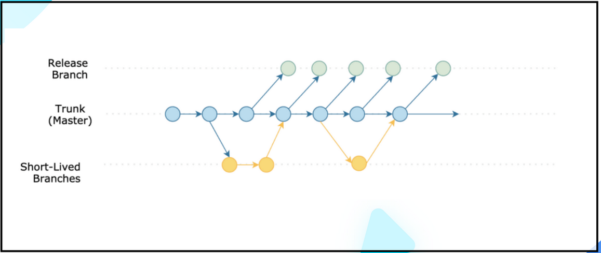

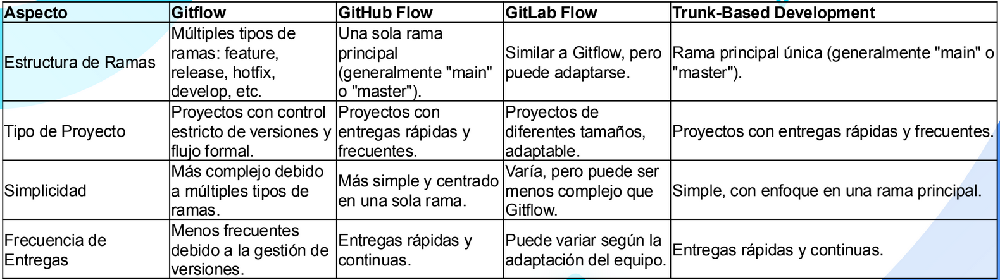

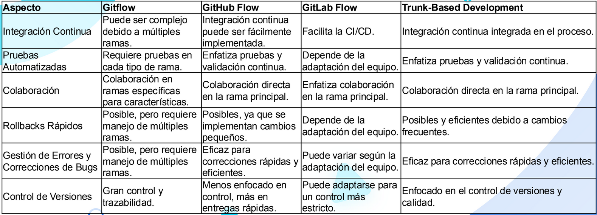

Git merge vs git rebase

Los comandos `git merge` y `git rebase` en Git sirven para integrar los cambios de una rama en otra, pero utilizan enfoques diferentes. `git merge` crea un nuevo “commit” de fusión que conserva la historia de ambas ramas, lo que resulta en una línea de tiempo de
desarrollo más clara y detallada.

Por otro lado, `git rebase` reorganiza la historia de la rama de destino moviendo los “commits” de la rama fuente encima de la rama de destino, lo que da como resultado una línea de tiempo más lineal pero puede ser más propenso a conflictos.

### Enfoque de "git merge"
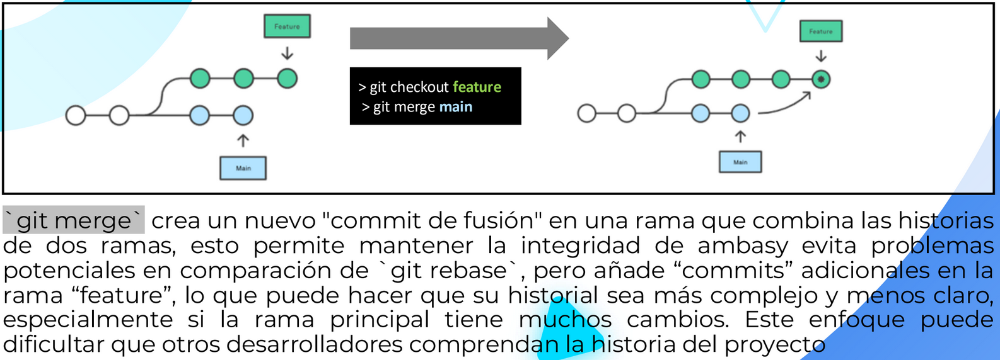

### Enfoque de "git rebase"
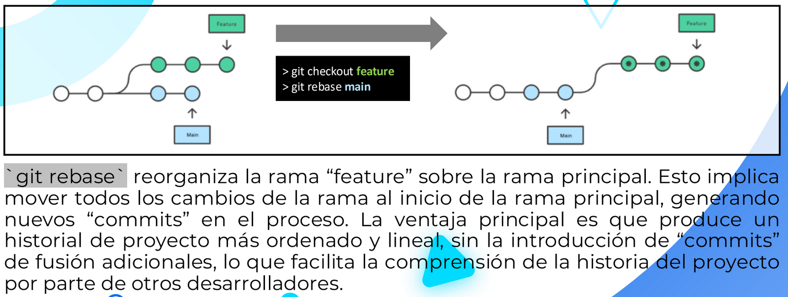

### el "rebase" interativo
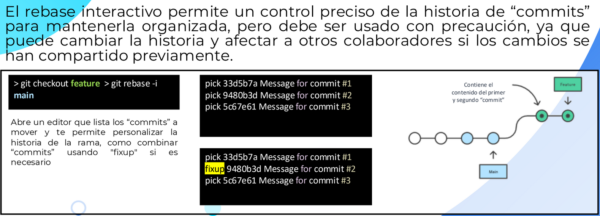

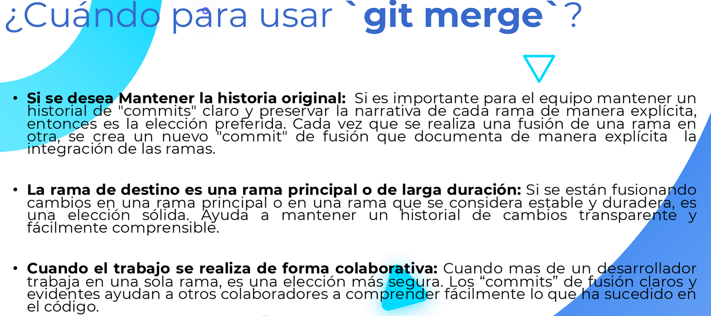

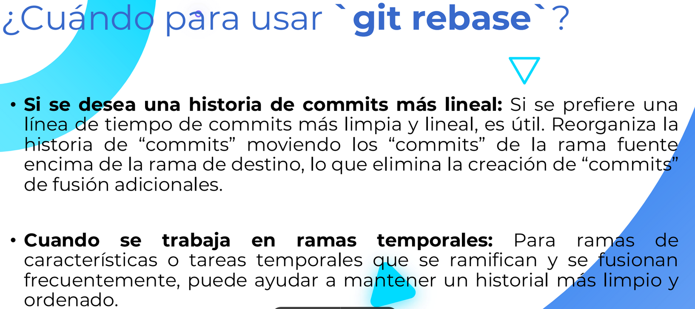

Git cherry pick

`git cherry-pick` es un comando de Git que te permite seleccionar y aplicar un
“commit” específico de una rama a otra. “cherry picking” es el acto de seleccionar
un commit de una rama y aplicarlo a otra.

Puede ser útil para deshacer cambios. Por ejemplo, supongamos que un commit se
hizo accidentalmente en la rama incorrecta. Puedes cambiar a la ramacorrecta y hacer un “cherry-pick” del  “commit” para que esté donde debería estar.
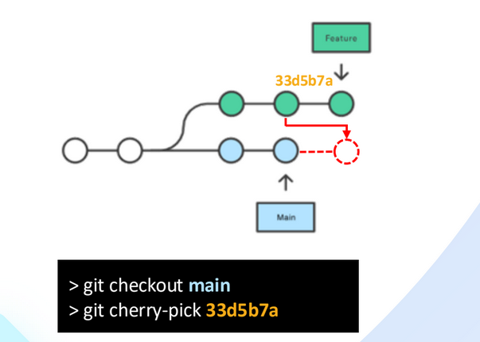

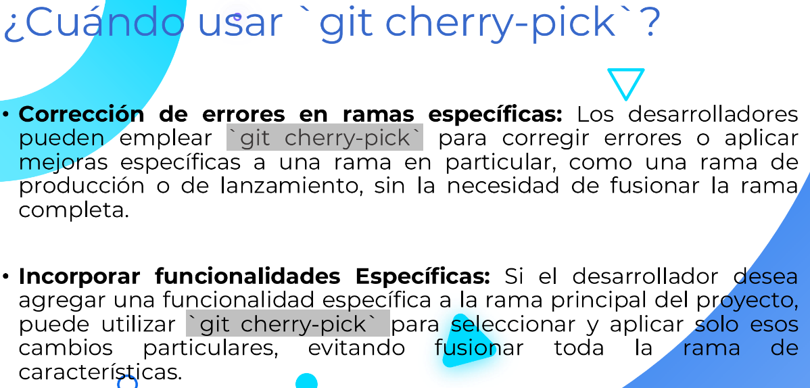

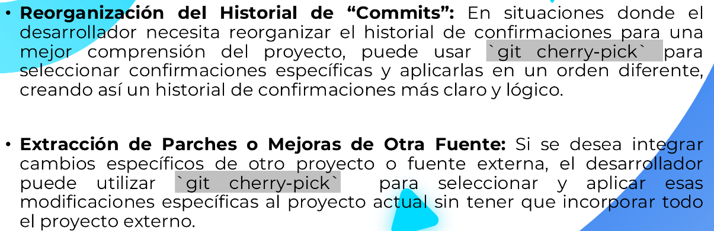

Revision de buenas practicas de codificacion

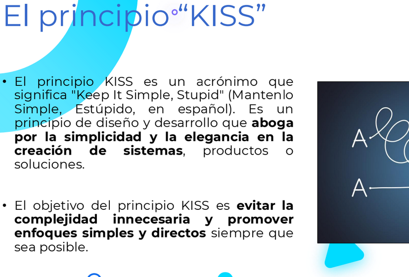

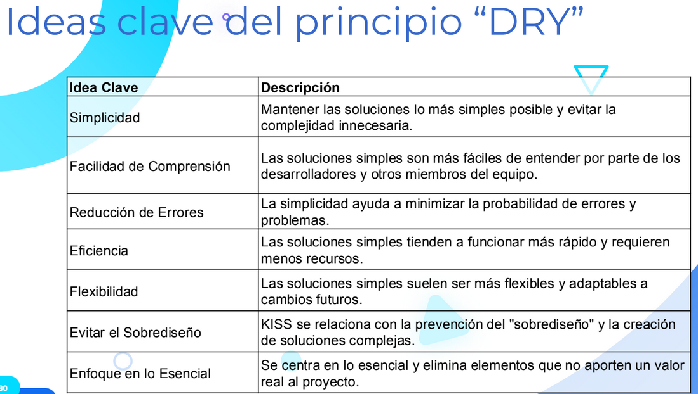

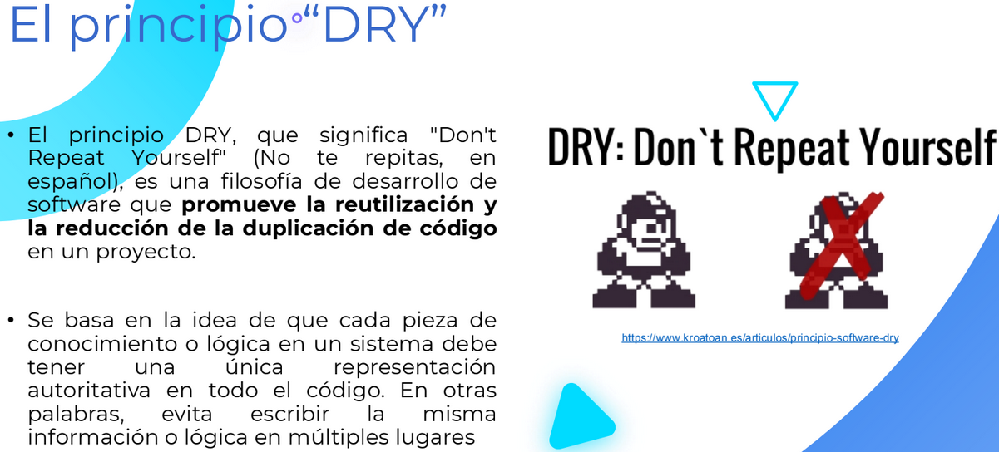

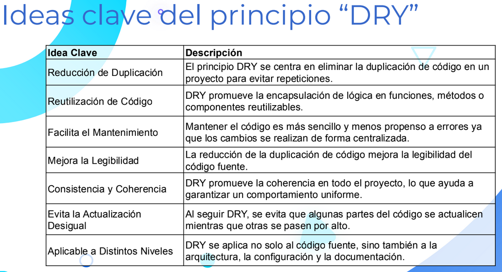

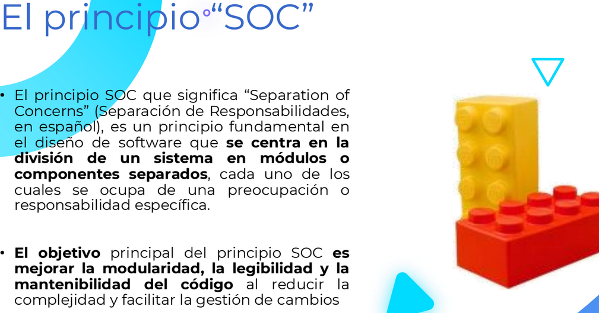

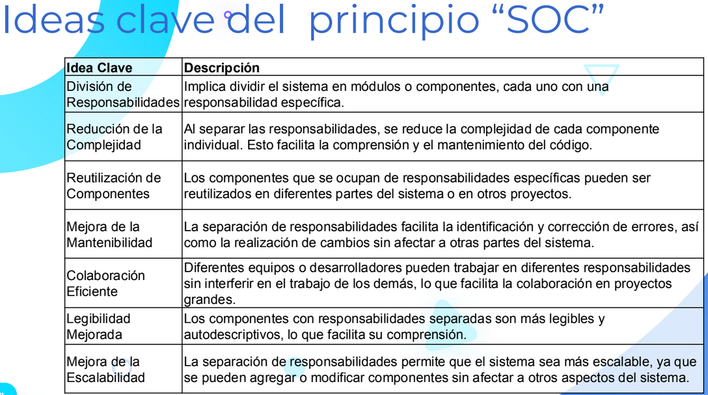

